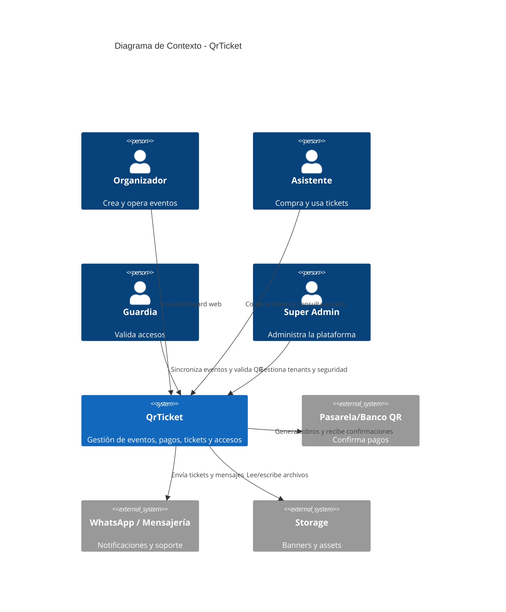
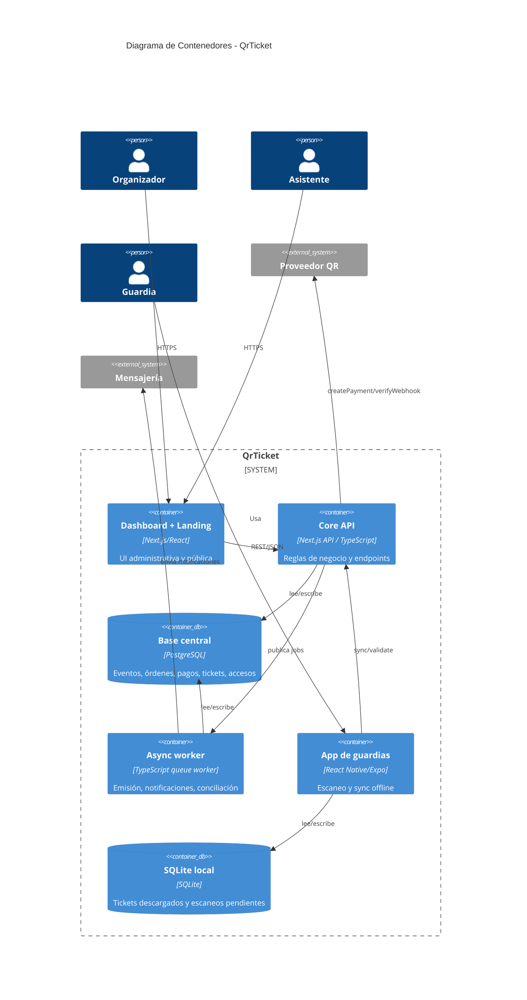
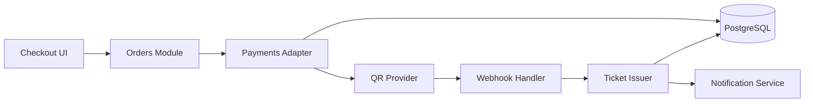
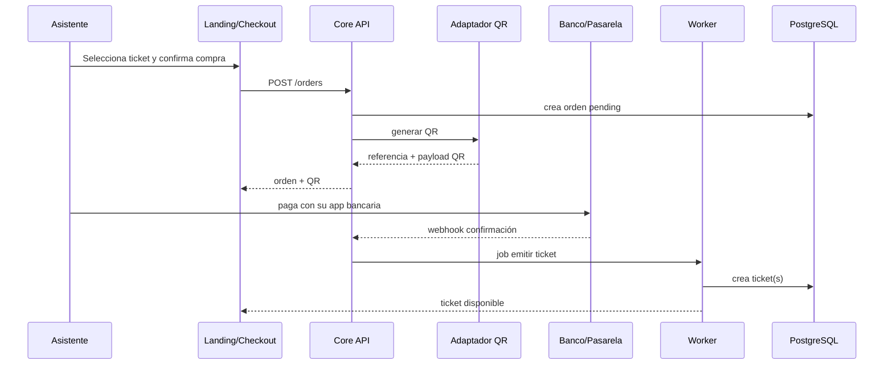
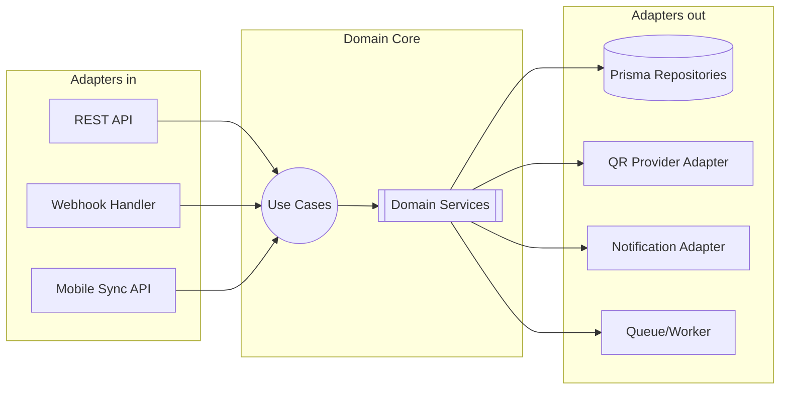
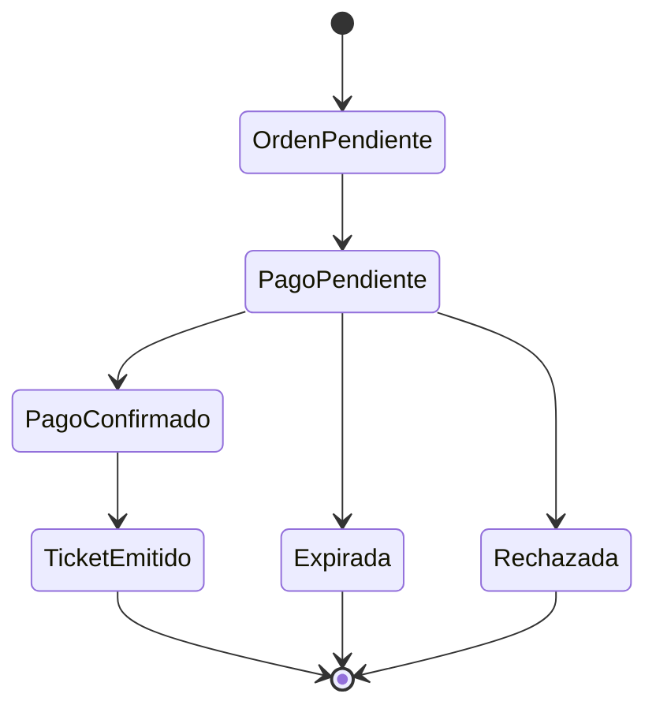
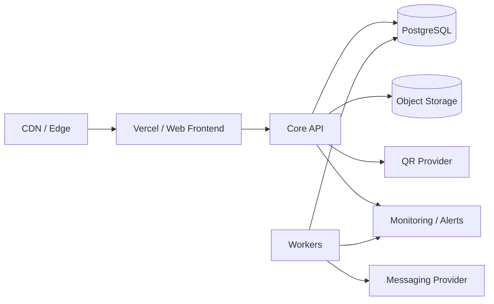

# Documento Técnico Inicial (DTI) — QrTicket

> Consolidación técnica inicial de QrTicket a partir de [BRD](brd/BRD_v0.1.md), [MRD](mrd/MRD_v0.1.md), [PRD](prd/PRD_v0.1.md), [FSD](fsd/FSD_v0.1.md) y [ADRs](adr/README.md). Estructurado a partir de [templates/DOCUMENTO_TECNICO_INICIAL_TEMPLATE.md](../templates/DOCUMENTO_TECNICO_INICIAL_TEMPLATE.md).

## 0. Metadatos

| Campo | Valor |
|-------|-------|
| Producto | Qrticket |
| Release evaluable | `release/1.0.0` |
| Sesión asociada | `S6` |
| Fecha de cierre | `13/05/2026` |
| Integrantes | `Antonio Ovando, @carlicode, Carla Marcela Florida Roman` |
| Versión | `v0.1` |
| Fecha | `13/05/2026` |
| Arquitecto responsable | Equipo QrTicket |
| Stakeholders | Producto, ingeniería, operaciones, soporte |
| Estado | Borrador |
| Enlace al BRD | `docs/brd/BRD_v0.1.md` |
| Enlace al MRD | `docs/mrd/MRD_v0.1.md` |
| Enlace al PRD | `docs/prd/PRD_v0.1.md` |
| Enlace al FSD | `docs/fsd/FSD_v0.1.md` |
| Enlace a `AGENTS.md` | `/AGENTS.md` |
| Enlace a `PROMPT_MAPPING.md` | `docs/PROMPT_MAPPING.md` |

## 1. Visión técnica del producto

- **Problema**: procesos manuales, fraude, conciliación lenta y validación frágil en eventos bolivianos.
- **Usuarios objetivo**: organizadores, asistentes, guardias y administradores.
- **Propuesta de valor**: ecosistema modular de ticketing QR con pagos locales y operación offline para guardias.
- **Métricas de éxito**:
  - NSM: asistentes validados exitosamente por minuto.
  - KPI-1: validación p95 `<= 1500 ms`.
  - KPI-2: fraude `< 1%`.
  - KPI-3: sync offline exitoso `>= 95%`.
  - KPI-4: disponibilidad `>= 99.5%` en días de evento.
- **Restricciones clave**: equipo pequeño, tiempo acotado, dependencia de pagos externos, conectividad variable en recintos.

## 2. Contexto del sistema

### 2.1 Diagrama C4 — Nivel 1 (Contexto)

### 2.2 Actores externos y dependencias

| Actor / Sistema | Tipo | Dirección | Criticidad |
|-----------------|------|-----------|------------|
| Pasarela/Banco QR | externo | entrada/salida | alta |
| WhatsApp / Email provider | externo | salida | media |
| Storage de archivos | externo | salida | media |
| Dispositivo móvil guardia | edge | bidireccional | alta |

## 3. Arquitectura de alto nivel

### 3.1 Estilo arquitectónico adoptado

- **Monolito modular** para el core web/backend.
- **Cliente móvil offline-first** para guardias.
- **Integraciones por adaptadores** para pagos y notificaciones.
- **Mensajería/eventos internos ligeros** para procesos asíncronos como confirmación de pagos, emisión de tickets y notificaciones.

Esta combinación reduce complejidad temprana y a la vez respeta límites claros entre dominios del negocio.

### 3.2 Diagrama C4 — Nivel 2 (Contenedores)

### 3.3 Diagrama C4 — Nivel 3 (Componentes del flujo compra-pago-ticket)

### 3.4 Data Flow Diagram del caso de uso más crítico

## 4. Modelo de dominio

### 4.1 Bounded Contexts

| Contexto | Responsabilidad | Entidades principales | Tipo de integración |
|----------|-----------------|-----------------------|---------------------|
| Auth & Identity | usuarios, roles, sesiones | User, Role, Organization | síncrona |
| Events | eventos, landing, branding, aforo | Event, Venue, TicketType | síncrona |
| Commerce | órdenes, pagos, pricing, expiración | Order, Payment | síncrona + async |
| Tickets | emisión, QR, estados, recovery | Ticket | síncrona + async |
| Access Control | guardias, sync, access logs, antifraude | GuardAssignment, AccessLog, OfflineSnapshot | síncrona + async |
| Reporting | KPIs, ventas, asistencia | MetricsView | asíncrona / lectura |
| Notifications | email, WhatsApp, reenvíos | NotificationJob | async |

### 4.2 Entidades, Value Objects y Aggregates

| Tipo | Nombre | Invariantes | Ciclo de vida |
|------|--------|-------------|---------------|
| Aggregate Root | Event | estado válido, tenant aislado | draft → active → finished/cancelled |
| Aggregate Root | Order | una referencia de pago, expiración controlada | pending → confirmed/rejected/expired |
| Aggregate Root | Ticket | QR único, un estado vigente | active → used/refunded/cancelled/expired |
| Aggregate Root | OfflineSnapshot | versión monotónica | creado y reemplazado por sync |
| Value Object | Money | monto y moneda consistentes | inmutable |
| Value Object | QrToken | token firmado y verificable | inmutable |

### 4.3 DTOs principales

| DTO | Uso | Campos | Mapeo |
|-----|-----|--------|--------|
| `CreateEventDto` | API entrada | `title, dates, venue, capacity` | `Event` |
| `CreateOrderDto` | API entrada | `eventId, ticketTypeId, buyer` | `Order` |
| `PaymentWebhookDto` | integración | `reference, amount, status, signature` | `Payment` |
| `OfflineSyncDto` | mobile | `eventId, syncVersion` | `OfflineSnapshot` |
| `ScanResultDto` | access | `ticketToken, guardId, gate, mode` | `AccessLog` |

## 5. Arquitectura hexagonal del core

### 5.1 Puertos (Ports)

| Puerto | Tipo | Definido en | Propósito |
|--------|------|-------------|-----------|
| `CreateEventUseCase` | input | `events` | alta de evento |
| `CreateOrderUseCase` | input | `commerce` | generar orden pending |
| `ConfirmPaymentUseCase` | input | `payments` | aceptar callback y orquestar emisión |
| `ValidateTicketUseCase` | input | `access` | decidir acceso online |
| `EventRepository` | output | `events` | persistencia eventos |
| `PaymentProviderPort` | output | `payments` | hablar con proveedor QR |
| `NotificationPort` | output | `notifications` | enviar tickets y avisos |
| `OfflineSnapshotPort` | output | `access` | obtener datasets móviles |

### 5.2 Adaptadores (Adapters)

| Adaptador | Implementa | Tecnología | Ubicación lógica |
|-----------|------------|------------|------------------|
| REST controllers | input ports | Next.js API | `/api/*` |
| Prisma repositories | output ports | Prisma | `infra/persistence` |
| QR provider adapter | `PaymentProviderPort` | HTTPS SDK/REST | `infra/payments` |
| WhatsApp/email adapters | `NotificationPort` | HTTPS | `infra/notifications` |
| SQLite sync adapter | `OfflineSnapshotPort` consumidor mobile | React Native + SQLite | `mobile/access` |

### 5.3 Diagrama de puertos y adaptadores

## 6. Arquitectura distribuida (si aplica)

> En v1.0 no se adopta microservicios. La separación se mantiene lógica, no de despliegue. Candidatos futuros de extracción: `payments` y `access`.

## 7. Arquitectura asíncrona / event-driven

### 7.1 Catálogo de eventos

| Evento | Productor | Consumidor(es) | Payload | Garantía |
|--------|-----------|----------------|---------|----------|
| `OrderCreated` | commerce | payments, notifications | order summary | at-least-once |
| `PaymentConfirmed` | payments | tickets, notifications, reporting | payment + order ref | at-least-once |
| `TicketIssued` | tickets | notifications, reporting | ticket summary | at-least-once |
| `OfflineScansSynced` | access | reporting, audit | scan batch result | at-least-once |
| `FraudDetected` | access | admin/reporting | ticket + reason | at-least-once |

### 7.2 Flujo de larga duración principal

## 8. Despliegue y cloud

### 8.1 Mapeo inicial

- Frontend/dashboard/landing: Vercel o entorno equivalente.
- Core API + workers: Railway, AWS o contenedores propios.
- PostgreSQL: proveedor gestionado.
- Storage: bucket S3-compatible.
- Observabilidad: logs centralizados, métricas y alertas.

### 8.2 Diagrama de despliegue conceptual

## 9. Seguridad y observabilidad

- JWT y refresh tokens para sesiones.
- RBAC por rol y tenant.
- Auditoría de órdenes, pagos y escaneos.
- Cifrado en tránsito obligatorio.
- Idempotencia en callbacks y reconciliación.
- Alertas por fraude, retraso de sync y caídas de proveedor.

## 10. POCs recomendadas

| POC | Objetivo | Owner sugerido | Estado |
|-----|----------|----------------|--------|
| POC-01 | validar proveedor QR y webhook idempotente | backend | propuesta |
| POC-02 | validar rendimiento de escaneo y sync offline con SQLite | mobile | propuesta |
| POC-03 | validar generación/validación de QR firmado | backend/security | propuesta |
| POC-04 | validar throughput de evento con múltiples puertas | backend/ops | propuesta |

## 11. Riesgos técnicos

| Riesgo | Impacto | Mitigación |
|--------|---------|------------|
| dependencia de proveedor QR | alta | adaptadores + fallback operativo |
| conflictos de sync offline | alta | versionado y reconciliación explícita |
| sobreventa por concurrencia | alta | transacciones y reserva temporal |
| latencia en picos de acceso | alta | dataset local + tuning |
| observabilidad insuficiente | media | métricas y trazas desde v1.0 |

## 12. Registro de cambios

| Versión | Fecha | Autor | Cambio |
|---------|-------|-------|--------|
| v0.1 | 13/05/2026 | Equipo QrTicket | Primera consolidación técnica del producto |
