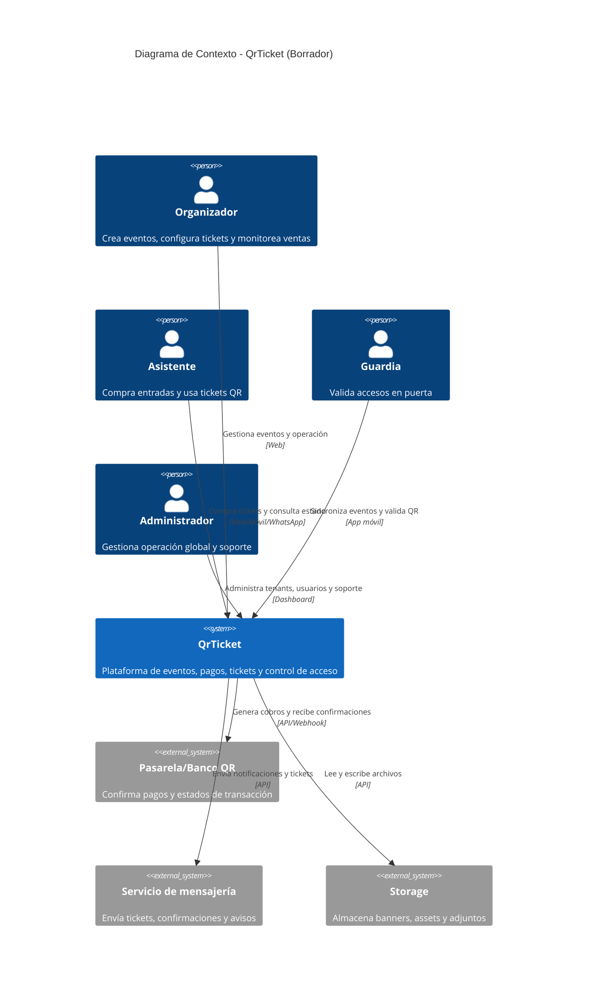

# Documento Técnico Inicial (DTI) — QrTicket (Borrador)

> Borrador inicial enfocado en el contexto del sistema y un primer diagrama **C4 Nivel 1**.

## §0. Metadatos

| Campo | Valor |
|-------|-------|
| Producto | Qrticket |
| Release evaluable | `release/1.0.0` |
| Sesión asociada | `S6` |
| Fecha de cierre | `13/05/2026` |
| Integrantes | `Antonio Ovando, @carlicode, Carla Marcela Florida Roman` |
| Versión | `v0.1-borrador` |
| Estado | Borrador |
| Propósito | Esbozar el DTI y definir el contexto C4 Nivel 1 |
| Documento relacionado | `docs/DTI.md` |

## §1. Esbozo de contexto del sistema (C4 Nivel 1)

QrTicket es una plataforma orientada a la gestión de eventos, venta de entradas digitales y control de acceso mediante QR. En esta primera aproximación técnica, el sistema se entiende como un ecosistema con cuatro actores principales: organizadores, asistentes, guardias y administradores. Además, depende de servicios externos clave como pasarelas o bancos QR, mensajería y almacenamiento.

Este borrador C4 Nivel 1 busca responder una pregunta simple: **quién usa el sistema, qué sistemas externos lo rodean y cómo se relacionan con QrTicket**. No detalla aún contenedores, módulos internos ni decisiones de despliegue; sólo fija el alcance contextual del producto.

### Borrador de diagrama C4 Nivel 1

### Notas del borrador

- El canal WhatsApp aparece por ahora como interfaz de negocio, no como contenedor independiente.
- La app de guardias se considera parte del ecosistema QrTicket, pero su detalle se deja para C4 Nivel 2.
- La integración con bancos y pasarelas QR todavía está abstracta y deberá cerrarse en una ADR o POC posterior.
- En la siguiente iteración conviene expandir este borrador con §2 Arquitectura de alto nivel y C4 Nivel 2.
