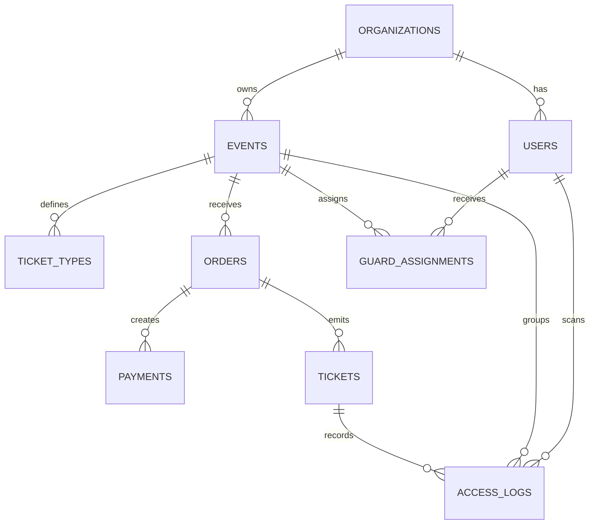

# Functional Specification Document — QrTicket

> Especificación funcional de QrTicket basada en [docs/prd/PRD_v0.1.md](../prd/PRD_v0.1.md) y estructurada con [templates/FSD_TEMPLATE.md](../../templates/FSD_TEMPLATE.md).

## 0. Metadatos

| Campo | Valor |
|-------|-------|
| Producto | Qrticket |
| Release evaluable | `release/1.0.0` |
| Sesión asociada | `S6` |
| Fecha de cierre | `13/05/2026` |
| Integrantes | `Antonio Ovando, @carlicode, Carla Marcela Florida Roman` |
| Versión del documento | `v0.1` |
| Fecha | `13/05/2026` |
| Autores | Equipo QrTicket |
| Revisores | Docente + 1 grupo par |
| Estado | Borrador |
| Trazabilidad a PRD | `docs/prd/PRD_v0.1.md` |

## 1. Resumen ejecutivo

El FSD de QrTicket define el comportamiento funcional del MVP para el ciclo completo de un evento: creación del evento, configuración de tickets, publicación de la landing, generación de órdenes, confirmación de pagos, emisión de tickets QR, recuperación de tickets, operación offline en guardias, validación antifraude y reportería operativa. El documento prioriza 10 casos de uso críticos porque representan el camino mínimo para que el sistema sea útil en un evento real. Cada caso de uso incluye trazabilidad al PRD, flujo principal, alternos, reglas aplicables y criterios Gherkin. Además, el documento formaliza el modelo de datos funcional, los contratos operativos tipo prompt, las integraciones externas y los NFRs cuantificables más importantes del release.

## 2. Alcance

### 2.1 Dentro del alcance

- Gestión de eventos y tickets.
- Landing pública de evento.
- Órdenes de compra y pagos QR.
- Emisión y recuperación de tickets.
- Login de guardias, descarga offline y validación QR.
- Reportes operativos básicos por evento.

### 2.2 Fuera del alcance

- Reventa oficial.
- Seats numerados en producción.
- IA transaccional completa en WhatsApp.
- Pricing dinámico.
- Marketplace y loyalty.

### 2.3 Supuestos y dependencias

- Backend central expone APIs autenticadas para dashboard y apps.
- La app de guardias usa SQLite local para tickets descargados y escaneos pendientes.
- La confirmación de pago depende de proveedor externo vía webhook o conciliación.
- El QR del ticket representa un token firmado, no un dato visual plano.

## 3. Actores y roles del sistema

| Actor | Tipo | Responsabilidad principal | Permisos clave |
|-------|------|---------------------------|----------------|
| Super Admin | humano | configuración global, tenants, auditoría | acceso total multi-tenant |
| Organizador / Manager | humano | crear eventos, tickets, guardias, revisar reportes | CRUD sobre su organización |
| Guardia | humano | descargar evento y validar accesos | acceso sólo a eventos asignados |
| Asistente | humano | comprar, consultar y recuperar tickets | acceso a sus órdenes y tickets |
| Pasarela / Banco QR | sistema | confirmar pagos | webhook / consulta de estado |
| Servicio de notificaciones | sistema | email / WhatsApp / push | envío de tickets y avisos |
| Motor de sincronización | sistema | reconciliar datos offline/online | replicación incremental |

## 4. Casos de uso funcionales

### 4.1 FSD-UC-001 — Crear evento

- **Trazabilidad**: `PRD-REQ-001`, `PRD-US-001`
- **Actor principal**: Organizador
- **Precondiciones**:
  1. Organizador autenticado.
  2. Organización activa.
- **Disparador**: el organizador selecciona “Nuevo evento”.
- **Flujo principal**:
  1. Ingresa título, resumen, fecha, hora, ubicación y capacidad.
  2. El sistema valida campos obligatorios.
  3. El sistema crea el evento en estado `draft`.
  4. El sistema registra auditoría de creación.
- **Flujos alternativos / excepciones**:
  - A1: datos obligatorios faltantes → se bloquea el guardado y se muestran errores.
  - A2: fecha final anterior a fecha inicial → se rechaza la operación.
- **Postcondiciones**:
  1. Evento persistido.
  2. Estado inicial `draft`.
- **Reglas aplicables**: `RB-07`
- **Datos de entrada**: título, slug, resumen, fechas, ubicación, capacidad.
- **Datos de salida**: `eventId`, estado, timestamp.
- **Criterios de aceptación**:

```gherkin
Escenario: Crear evento válido
  Dado un organizador autenticado
  Cuando registra datos válidos del evento
  Entonces el sistema crea el evento en estado draft
   Y devuelve su identificador
```

### 4.2 FSD-UC-002 — Configurar tickets y cupos

- **Trazabilidad**: `PRD-REQ-002`, `PRD-US-004`, `PRD-US-005`, `PRD-US-006`
- **Actor principal**: Organizador
- **Precondiciones**:
  1. Evento existente en `draft` o `active`.
- **Disparador**: el organizador abre la configuración de tickets.
- **Flujo principal**:
  1. Define nombre, precio, cupo y color del ticket.
  2. Opcionalmente define ventana de venta y restricciones.
  3. El sistema valida consistencia de capacidad.
  4. El sistema guarda el ticket y recalcula disponibilidad.
- **Flujos alternativos / excepciones**:
  - A1: cupo total supera capacidad del evento → rechazo.
  - A2: precio negativo → rechazo.
- **Postcondiciones**:
  1. Ticket disponible para publicación.
  2. Cupos visibles en dashboard.
- **Reglas aplicables**: `RB-05`
- **Datos de entrada**: tipo, precio, cupo, fechas, restricciones.
- **Datos de salida**: `ticketTypeId`, disponibilidad.
- **Criterios de aceptación**:

```gherkin
Escenario: Crear ticket dentro del aforo
  Dado un evento existente
  Cuando el organizador crea un ticket con cupo válido
  Entonces el sistema guarda el ticket y actualiza la disponibilidad del evento
```

### 4.3 FSD-UC-003 — Publicar landing del evento

- **Trazabilidad**: `PRD-REQ-003`, `PRD-REQ-015`, `PRD-US-003`, `PRD-US-007`
- **Actor principal**: Organizador
- **Precondiciones**:
  1. Evento con datos completos.
  2. Al menos un ticket activo.
- **Disparador**: el organizador selecciona “Publicar”.
- **Flujo principal**:
  1. El sistema valida integridad mínima del evento.
  2. Genera/actualiza la landing pública.
  3. Cambia el estado a `active`.
  4. Expone el evento al catálogo público.
- **Flujos alternativos / excepciones**:
  - A1: no hay tickets configurados → publicación bloqueada.
  - A2: faltan fechas o ubicación → publicación bloqueada.
- **Postcondiciones**:
  1. Landing accesible por URL pública.
  2. Evento visible para compra.
- **Reglas aplicables**: `RB-07`
- **Datos de entrada**: branding, banner, descripción, FAQ, estado.
- **Datos de salida**: URL pública, estado publicado.
- **Criterios de aceptación**:

```gherkin
Escenario: Publicar evento listo para venta
  Dado un evento con tickets configurados
  Cuando el organizador publica el evento
  Entonces la landing pública queda disponible
   Y el estado del evento cambia a active
```

### 4.4 FSD-UC-004 — Generar orden de compra y QR de pago

- **Trazabilidad**: `PRD-REQ-004`, `PRD-REQ-005`, `PRD-US-008`, `PRD-US-009`, `PRD-US-010`
- **Actor principal**: Asistente
- **Precondiciones**:
  1. Evento publicado.
  2. Ticket con cupo disponible.
- **Disparador**: el asistente inicia la compra.
- **Flujo principal**:
  1. Selecciona ticket y cantidad permitida.
  2. Completa datos de comprador.
  3. El sistema calcula total y reserva temporalmente cupo.
  4. El sistema crea una orden `pending`.
  5. El sistema genera QR de pago y referencia única.
- **Flujos alternativos / excepciones**:
  - A1: ticket agotado durante el checkout → se informa indisponibilidad.
  - A2: datos inválidos del comprador → se solicitan correcciones.
- **Postcondiciones**:
  1. Orden pendiente creada.
  2. QR de pago asociado.
- **Reglas aplicables**: `RB-05`
- **Datos de entrada**: ticket, cantidad, comprador, canal.
- **Datos de salida**: `orderId`, `paymentReference`, QR de pago.
- **Criterios de aceptación**:

```gherkin
Escenario: Generar orden pendiente con QR de pago
  Dado un ticket disponible en un evento activo
  Cuando el asistente completa sus datos y confirma la compra
  Entonces el sistema crea una orden pending
   Y genera un QR de pago único para esa orden
```

### 4.5 FSD-UC-005 — Confirmar pago y emitir ticket QR

- **Trazabilidad**: `PRD-REQ-006`, `PRD-REQ-007`, `PRD-US-011`, `PRD-US-012`
- **Actor principal**: Pasarela/Banco QR
- **Precondiciones**:
  1. Orden `pending` existente.
  2. Referencia de pago emitida.
- **Disparador**: recepción de webhook válido o confirmación por conciliación.
- **Flujo principal**:
  1. El sistema valida la autenticidad del callback.
  2. Busca la orden por referencia.
  3. Cambia el pago a `confirmed`.
  4. Emite uno o más tickets con QR único.
  5. Notifica al comprador por canales configurados.
- **Flujos alternativos / excepciones**:
  - A1: referencia inexistente → se descarta y se audita.
  - A2: callback duplicado → el sistema responde idempotentemente.
  - A3: pago rechazado → orden queda `rejected`.
- **Postcondiciones**:
  1. Tickets emitidos.
  2. Orden confirmada o rechazada.
- **Reglas aplicables**: `RB-03`, `RB-08`
- **Datos de entrada**: referencia, monto, estado del pago, firma del proveedor.
- **Datos de salida**: tickets emitidos, notificación, auditoría.
- **Criterios de aceptación**:

```gherkin
Escenario: Emitir ticket tras pago confirmado
  Dado una orden pending con referencia válida
  Cuando el proveedor confirma el pago
  Entonces el sistema cambia la orden a confirmed
   Y emite tickets QR únicos asociados al comprador
```

### 4.6 FSD-UC-006 — Recuperar o reenviar ticket

- **Trazabilidad**: `PRD-REQ-008`, `PRD-REQ-016`, `PRD-US-013`, `PRD-US-014`, `PRD-US-015`
- **Actor principal**: Asistente o Soporte
- **Precondiciones**:
  1. Ticket emitido.
- **Disparador**: usuario solicita recuperación o soporte busca la orden.
- **Flujo principal**:
  1. El usuario se identifica por correo, teléfono o código de orden.
  2. El sistema localiza tickets activos asociados.
  3. El sistema muestra o reenvía el ticket por canal permitido.
- **Flujos alternativos / excepciones**:
  - A1: no existen coincidencias → mensaje claro de no encontrado.
  - A2: ticket reembolsado o cancelado → se informa estado actual.
- **Postcondiciones**:
  1. Usuario vuelve a tener acceso a su ticket.
- **Reglas aplicables**: `RB-01`
- **Datos de entrada**: correo, teléfono, código de orden.
- **Datos de salida**: ticket, estado, envío de notificación.
- **Criterios de aceptación**:

```gherkin
Escenario: Reenviar ticket existente
  Dado un ticket activo emitido
  Cuando el usuario solicita recuperación con un dato coincidente
  Entonces el sistema encuentra el ticket
   Y lo reenvía por el canal configurado
```

### 4.7 FSD-UC-007 — Descargar dataset offline para guardia

- **Trazabilidad**: `PRD-REQ-009`, `PRD-REQ-010`, `PRD-US-017`, `PRD-US-018`, `PRD-US-019`
- **Actor principal**: Guardia
- **Precondiciones**:
  1. Guardia autenticado.
  2. Evento asignado.
- **Disparador**: el guardia pulsa “Sincronizar evento”.
- **Flujo principal**:
  1. La app solicita tickets y metadatos del evento.
  2. El backend entrega snapshot o delta incremental.
  3. La app persiste información en SQLite local.
  4. La app marca fecha de última sincronización.
- **Flujos alternativos / excepciones**:
  - A1: no hay red → se mantiene último dataset y se avisa al guardia.
  - A2: evento no asignado → acceso denegado.
- **Postcondiciones**:
  1. Dataset local listo para validación offline.
- **Reglas aplicables**: `RB-04`
- **Datos de entrada**: `eventId`, `guardId`, versión de sync.
- **Datos de salida**: tickets válidos, puertas, timestamp, hash de sync.
- **Criterios de aceptación**:

```gherkin
Escenario: Descargar dataset del evento asignado
  Dado un guardia con evento asignado
  Cuando ejecuta la sincronización
  Entonces la app almacena tickets y metadatos en SQLite
   Y muestra la fecha de última sincronización
```

### 4.8 FSD-UC-008 — Validar ticket QR online

- **Trazabilidad**: `PRD-REQ-011`, `PRD-REQ-012`, `PRD-US-021`, `PRD-US-022`
- **Actor principal**: Guardia
- **Precondiciones**:
  1. Evento activo.
  2. Guardia autenticado y en pantalla de escaneo.
- **Disparador**: el guardia escanea un QR con conectividad disponible.
- **Flujo principal**:
  1. La app envía el token al backend.
  2. El backend valida firma, evento, estado y uso previo.
  3. Si es válido, marca el ticket como usado y registra el acceso.
  4. Devuelve resultado verde con datos mínimos.
- **Flujos alternativos / excepciones**:
  - A1: ticket ya usado → resultado rojo con motivo.
  - A2: ticket de otro evento → resultado rojo.
  - A3: ticket cancelado/reembolsado → resultado rojo.
- **Postcondiciones**:
  1. Access log persistido.
  2. Ticket actualizado si corresponde.
- **Reglas aplicables**: `RB-02`, `RB-06`, `RB-08`
- **Datos de entrada**: token QR, `guardId`, `eventId`, puerta.
- **Datos de salida**: resultado, motivo, timestamp.
- **Criterios de aceptación**:

```gherkin
Escenario: Validar ticket online válido
  Dado un ticket activo del evento correcto
  Cuando el guardia escanea el QR con internet
  Entonces el backend valida el token
   Y responde con acceso válido
   Y registra el ticket como usado
```

### 4.9 FSD-UC-009 — Validar ticket QR offline y reconciliar

- **Trazabilidad**: `PRD-REQ-011`, `PRD-REQ-012`, `PRD-US-021`, `PRD-US-022`, `PRD-US-023`
- **Actor principal**: Guardia
- **Precondiciones**:
  1. Dataset del evento descargado previamente.
- **Disparador**: el guardia escanea un QR sin conectividad.
- **Flujo principal**:
  1. La app consulta SQLite local.
  2. Verifica que el ticket exista y no esté marcado como usado localmente.
  3. Registra el escaneo como pendiente de sync.
  4. Muestra resultado operativo al guardia.
  5. Al recuperar conectividad, envía lote de validaciones pendientes.
  6. El backend reconcilia conflictos e inserta access logs oficiales.
- **Flujos alternativos / excepciones**:
  - A1: ticket no existe en dataset → rojo por desconocido.
  - A2: ticket ya usado localmente → rojo por duplicado.
  - A3: conflicto al reconciliar → backend marca incidencia para revisión.
- **Postcondiciones**:
  1. Validación local completada.
  2. Sync posterior intentado automáticamente o manualmente.
- **Reglas aplicables**: `RB-02`, `RB-06`
- **Datos de entrada**: token QR, dataset local, lote de pendientes.
- **Datos de salida**: resultado local, pendientes de sync, resolución de conflicto.
- **Criterios de aceptación**:

```gherkin
Escenario: Validar ticket offline y sincronizar después
  Dado un dataset offline vigente
  Cuando el guardia escanea un ticket válido sin internet
  Entonces la app permite el acceso y guarda el escaneo como pendiente
   Y al volver la red sincroniza el evento con el backend
```

### 4.10 FSD-UC-010 — Consultar reportes de ventas y asistencia

- **Trazabilidad**: `PRD-REQ-013`, `PRD-US-024`, `PRD-US-025`
- **Actor principal**: Organizador
- **Precondiciones**:
  1. Evento existente.
  2. Usuario con permisos de lectura.
- **Disparador**: el organizador abre el dashboard del evento.
- **Flujo principal**:
  1. El sistema agrega ventas, ingresos, tickets emitidos y usados.
  2. Calcula no-shows y avance de aforo.
  3. Muestra KPIs y series temporales básicas.
- **Flujos alternativos / excepciones**:
  - A1: evento sin ventas → dashboard vacío pero operativo.
  - A2: sync offline pendiente → indicador de datos parciales.
- **Postcondiciones**:
  1. KPIs disponibles para el organizador.
- **Reglas aplicables**: `RB-07`
- **Datos de entrada**: `eventId`, rango temporal opcional.
- **Datos de salida**: KPIs, series, resumen por ticket.
- **Criterios de aceptación**:

```gherkin
Escenario: Ver dashboard del evento
  Dado un organizador con permisos sobre un evento
  Cuando abre el dashboard operativo
  Entonces ve ingresos, tickets emitidos, tickets usados y no-shows
```

## 5. Reglas de negocio

| ID | Regla | Tipo | Origen | Casos de uso afectados |
|----|-------|------|--------|------------------------|
| BR-F-001 | Un evento nace en estado `draft` y sólo puede publicarse si tiene al menos un ticket habilitado | validación | PRD | UC-001, UC-003 |
| BR-F-002 | La suma de cupos configurados no puede superar la capacidad del evento salvo configuración explícita del organizador | validación | PRD | UC-002 |
| BR-F-003 | Una orden de compra reserva cupo temporalmente hasta expirar o confirmarse | política | negocio | UC-004 |
| BR-F-004 | La referencia de pago debe ser única por orden | validación | pagos | UC-004, UC-005 |
| BR-F-005 | Un callback de pago debe ser idempotente | política | pagos | UC-005 |
| BR-F-006 | Todo ticket emitido debe tener un token QR único y verificable | seguridad | negocio | UC-005, UC-008, UC-009 |
| BR-F-007 | Un ticket usado no puede validarse nuevamente salvo override administrativo posterior al evento | política | acceso | UC-008, UC-009 |
| BR-F-008 | La app de guardias sólo descarga datasets de eventos asignados | seguridad | RBAC | UC-007 |
| BR-F-009 | Toda validación, exitosa o fallida, debe dejar traza de auditoría | política | auditoría | UC-008, UC-009 |
| BR-F-010 | Los conflictos de sync offline nunca deben borrar evidencia de un escaneo realizado | política | sync | UC-009 |
| BR-F-011 | Los reportes del evento deben advertir si existen validaciones pendientes de reconciliación | política | reporting | UC-010 |
| BR-F-012 | El organizador sólo puede operar recursos de su organización | seguridad | multi-tenant | UC-001..UC-010 |

## 6. Modelo de datos funcional

### 6.1 Diagrama ER (Mermaid)



### 6.2 Diccionario de datos

| Entidad | Atributo | Tipo | Obligatorio | Validaciones | Origen |
|---------|----------|------|-------------|--------------|--------|
| `organizations` | `id` | UUID | sí | UUIDv4 | sistema |
| `users` | `role` | enum | sí | `super_admin/manager/guard/attendee` | sistema |
| `events` | `status` | enum | sí | `draft/active/sold_out/finished/cancelled` | sistema |
| `events` | `capacity` | integer | sí | `> 0` | organizador |
| `ticket_types` | `price` | decimal | sí | `>= 0` | organizador |
| `ticket_types` | `quota` | integer | sí | `>= 0` | organizador |
| `orders` | `status` | enum | sí | `pending/confirmed/expired/rejected/refunded` | sistema |
| `orders` | `expires_at` | timestamp | sí | futura al crear | sistema |
| `payments` | `reference` | string | sí | única | sistema/proveedor |
| `payments` | `status` | enum | sí | `pending/confirmed/rejected/expired/refunded` | sistema |
| `tickets` | `qr_token` | string | sí | único y firmado | sistema |
| `tickets` | `status` | enum | sí | `active/used/cancelled/refunded/expired` | sistema |
| `guard_assignments` | `event_id` | UUID | sí | FK lógica | sistema |
| `offline_sync_snapshots` | `sync_version` | string | sí | monotónica | sistema |
| `access_logs` | `result` | enum | sí | `valid/used/invalid/wrong_event/conflict` | sistema |
| `access_logs` | `mode` | enum | sí | `online/offline/reconciled` | sistema |

## 7. Prompt como contrato funcional

### 7.1 Contrato UC-001

- **Role**: administrador de eventos del sistema.
- **Task**: crear un evento nuevo y devolver su estado inicial.
- **Context**: usuario autenticado, tenant activo, campos obligatorios del evento.
- **Reasoning**: validar tenant, validar fechas, persistir, auditar.
- **Stop condition**: detenerse al crear el evento o detectar error de validación.
- **Output**: JSON con `eventId`, `status`, `createdAt`.
- **Invariants**: el evento nace en `draft`; el organizador no sale de su tenant.
- **Failure modes**: `E_EVENT_INVALID`, `E_FORBIDDEN_TENANT`.

### 7.2 Contrato UC-002

- **Role**: configurador de tickets del evento.
- **Task**: crear o actualizar tipos de ticket sin romper el aforo.
- **Context**: evento existente, capacidad, cupos previos, reglas de ventana.
- **Reasoning**: sumar cupos, validar restricciones, persistir cambios.
- **Stop condition**: detenerse al guardar el ticket o detectar sobreventa estructural.
- **Output**: JSON con `ticketTypeId`, `availableQuota`.
- **Invariants**: precio no negativo; cupo total consistente.
- **Failure modes**: `E_CAPACITY_EXCEEDED`, `E_PRICE_INVALID`.

### 7.3 Contrato UC-003

- **Role**: publicador de landing del evento.
- **Task**: exponer un evento para venta pública.
- **Context**: evento completo, al menos un ticket activo, branding opcional.
- **Reasoning**: verificar readiness, cambiar estado, recalcular visibilidad.
- **Stop condition**: detenerse cuando el evento queda publicado o falte un requisito.
- **Output**: JSON con `publicUrl`, `status`.
- **Invariants**: no se publica un evento sin tickets.
- **Failure modes**: `E_EVENT_NOT_READY`, `E_NO_TICKETS`.

### 7.4 Contrato UC-004

- **Role**: motor de checkout.
- **Task**: crear orden pending y generar QR de pago.
- **Context**: ticket disponible, comprador válido, cupo temporal.
- **Reasoning**: validar stock, reservar cupo, crear orden, generar referencia y QR.
- **Stop condition**: detenerse cuando la orden y el QR estén listos o el cupo falle.
- **Output**: JSON con `orderId`, `paymentReference`, `paymentQr`.
- **Invariants**: una referencia por orden; estado inicial `pending`.
- **Failure modes**: `E_SOLD_OUT`, `E_ORDER_INVALID`.

### 7.5 Contrato UC-005

- **Role**: orquestador de pagos y emisión.
- **Task**: confirmar un pago y emitir tickets de forma idempotente.
- **Context**: callback firmado, orden pending, monto y referencia.
- **Reasoning**: validar callback, validar estado previo, emitir tickets, notificar.
- **Stop condition**: detenerse cuando la orden quede cerrada o el callback se descarte.
- **Output**: JSON con `orderStatus`, `ticketsIssued`.
- **Invariants**: no hay emisión sin pago confirmado; callback duplicado no duplica tickets.
- **Failure modes**: `E_PAYMENT_SIGNATURE`, `E_DUPLICATE_CALLBACK`, `E_ORDER_NOT_FOUND`.

### 7.6 Contrato UC-006

- **Role**: servicio de recuperación de tickets.
- **Task**: localizar y reenviar tickets emitidos.
- **Context**: correo, teléfono o código de orden válidos.
- **Reasoning**: buscar coincidencias, filtrar estados, enviar notificación.
- **Stop condition**: detenerse al entregar el ticket o no hallar coincidencias.
- **Output**: JSON con `ticketsFound`, `deliveryChannel`.
- **Invariants**: no se exponen tickets de otro usuario sin criterio válido.
- **Failure modes**: `E_TICKET_NOT_FOUND`, `E_DELIVERY_FAILED`.

### 7.7 Contrato UC-007

- **Role**: sincronizador offline de guardias.
- **Task**: descargar y persistir dataset del evento en SQLite.
- **Context**: guardia autenticado, evento asignado, versión de sync.
- **Reasoning**: validar permisos, traer snapshot/delta, almacenar localmente, registrar versión.
- **Stop condition**: detenerse al guardar el dataset o detectar evento no autorizado.
- **Output**: JSON con `syncVersion`, `recordsDownloaded`.
- **Invariants**: sólo eventos asignados; dataset consistente.
- **Failure modes**: `E_EVENT_NOT_ASSIGNED`, `E_SYNC_FAILED`.

### 7.8 Contrato UC-008

- **Role**: validador online de tickets.
- **Task**: aceptar o rechazar un QR en tiempo real.
- **Context**: token QR, evento, guardia, puerta.
- **Reasoning**: validar firma, pertenencia, estado, uso previo y horario.
- **Stop condition**: detenerse con decisión `valid` o un motivo explícito de rechazo.
- **Output**: JSON con `result`, `reason`, `usedAt`.
- **Invariants**: un ticket usado no vuelve a entrar; todo escaneo deja log.
- **Failure modes**: `E_QR_INVALID`, `E_TICKET_USED`, `E_WRONG_EVENT`.

### 7.9 Contrato UC-009

- **Role**: validador offline y reconciliador.
- **Task**: decidir localmente y sincronizar luego sin perder evidencia.
- **Context**: SQLite local, dataset vigente, lote de pendientes.
- **Reasoning**: consultar local, marcar local, emitir feedback, subir lote, resolver conflictos.
- **Stop condition**: detenerse tras registrar la validación local y, si hay red, reconciliar.
- **Output**: JSON con `localResult`, `syncStatus`, `conflicts`.
- **Invariants**: ningún escaneo offline se descarta silenciosamente.
- **Failure modes**: `E_LOCAL_NOT_FOUND`, `E_SYNC_CONFLICT`, `E_STALE_DATASET`.

### 7.10 Contrato UC-010

- **Role**: agregador de reportes de evento.
- **Task**: producir KPIs de ventas y asistencia.
- **Context**: evento, ventas, tickets, access logs, sync state.
- **Reasoning**: agregar métricas, marcar parcialidad, devolver resumen y series.
- **Stop condition**: detenerse cuando el dashboard tenga datos consolidados o parciales etiquetados.
- **Output**: JSON con `sales`, `attendance`, `noShows`, `syncWarning`.
- **Invariants**: los datos parciales se señalan; no se mezclan tenants.
- **Failure modes**: `E_REPORT_UNAVAILABLE`, `E_PARTIAL_DATA`.

## 8. Integraciones externas

| Sistema | Tipo | Protocolo | Operaciones | SLA esperado | Autenticación |
|---------|------|-----------|-------------|--------------|---------------|
| Pasarela QR / banco | síncrono + webhook | HTTPS | crear cobro, consultar estado, recibir confirmación | `>= 99%` | firma + credenciales |
| Servicio de email | síncrono | HTTPS/SMTP API | enviar ticket, reenvío, confirmaciones | `>= 99%` | API key |
| WhatsApp / mensajería | síncrono | HTTPS | avisos, recuperación de ticket | `>= 99%` | token proveedor |
| Almacenamiento de archivos | síncrono | HTTPS | guardar banners y assets | `>= 99%` | credenciales cloud |
| App de guardias | interno | HTTPS + SQLite | sync dataset, subir escaneos | `>= 99%` cuando hay red | JWT |

## 9. Interfaces de usuario (referencia)

| Pantalla | Caso de uso cubierto |
|----------|----------------------|
| Dashboard de eventos | FSD-UC-001, FSD-UC-002, FSD-UC-010 |
| Editor de evento | FSD-UC-001, FSD-UC-003 |
| Configuración de tickets | FSD-UC-002 |
| Landing pública | FSD-UC-003, FSD-UC-004 |
| Checkout / pago | FSD-UC-004, FSD-UC-005 |
| Historial y recuperación | FSD-UC-006 |
| App guardias / eventos asignados | FSD-UC-007 |
| App guardias / escaneo | FSD-UC-008, FSD-UC-009 |
| Dashboard analítico del evento | FSD-UC-010 |

## 10. Requerimientos no funcionales (NFR)

| ID | Categoría | Requisito | Métrica | Umbral | Cómo se verifica |
|----|-----------|-----------|---------|--------|------------------|
| NFR-001 | Rendimiento | Validación online de QR | p95 | `<= 1500 ms` | prueba de carga |
| NFR-002 | Rendimiento | Creación de orden | p95 | `<= 1000 ms` | prueba API |
| NFR-003 | Disponibilidad | Backend core en días de evento | uptime | `>= 99.5%` | monitoreo |
| NFR-004 | Confiabilidad | Reconciliación offline exitosa | porcentaje | `>= 95%` | logs de sync |
| NFR-005 | Seguridad | Cifrado en tránsito | cumplimiento | HTTPS obligatorio | auditoría técnica |
| NFR-006 | Seguridad | Detección de fraude por reuse | incidencia | `< 1%` por evento | auditoría funcional |
| NFR-007 | Observabilidad | Trazabilidad de orden, pago y acceso | cobertura | `100%` de eventos críticos | logs y tracing |
| NFR-008 | Escalabilidad | Escaneos sostenidos por puerta | throughput | `>= 50 scans/min` | stress test |
| NFR-009 | Usabilidad | Tiempo de capacitación de un guardia nuevo | minutos | `<= 15` | prueba operativa |
| NFR-010 | Recuperación | MTTR frente a incidente crítico del core | tiempo | `< 30 min` | postmortem / simulacro |

## 11. Trazabilidad MRD → PRD → FSD

| MRD | PRD | FSD | NFR | Prueba de aceptación |
|-----|-----|-----|-----|----------------------|
| MRD-N-01 | PRD-REQ-001 | FSD-UC-001 | NFR-007 | TC-001 |
| MRD-N-01 | PRD-REQ-002 | FSD-UC-002 | NFR-007 | TC-002 |
| MRD-N-02, MRD-N-11 | PRD-REQ-003, PRD-REQ-015 | FSD-UC-003 | NFR-002 | TC-003 |
| MRD-N-02, MRD-N-06 | PRD-REQ-004, PRD-REQ-005 | FSD-UC-004 | NFR-002 | TC-004 |
| MRD-N-03, MRD-N-06, MRD-N-07 | PRD-REQ-006, PRD-REQ-007 | FSD-UC-005 | NFR-005, NFR-007 | TC-005 |
| MRD-N-12 | PRD-REQ-008, PRD-REQ-016 | FSD-UC-006 | NFR-007 | TC-006 |
| MRD-N-05, MRD-N-09 | PRD-REQ-009, PRD-REQ-010 | FSD-UC-007 | NFR-004, NFR-009 | TC-007 |
| MRD-N-04, MRD-N-10 | PRD-REQ-011, PRD-REQ-012 | FSD-UC-008 | NFR-001, NFR-006, NFR-008 | TC-008 |
| MRD-N-05, MRD-N-10 | PRD-REQ-011, PRD-REQ-012 | FSD-UC-009 | NFR-004, NFR-006 | TC-009 |
| MRD-N-08 | PRD-REQ-013 | FSD-UC-010 | NFR-007 | TC-010 |

## 12. Plan de pruebas funcionales

- **Unitarias**: reglas de capacidad, expiración, antifraude, reconciliación.
- **Integración**: orden → pago → emisión; sync offline → reconciliación.
- **E2E**: compra completa, recuperación de ticket, validación en puerta.
- **Carga**: escaneo concurrente, creación de órdenes, dashboards.
- **Cobertura mínima esperada**: `>= 80%` del dominio core del release.

### Casos de prueba mínimos

| TC | Descripción |
|----|-------------|
| TC-001 | Crear evento válido |
| TC-002 | Configurar ticket sin romper aforo |
| TC-003 | Publicar landing sólo si el evento está listo |
| TC-004 | Crear orden y QR de pago |
| TC-005 | Confirmar pago y emitir ticket de forma idempotente |
| TC-006 | Recuperar ticket por correo/teléfono |
| TC-007 | Descargar dataset offline de evento asignado |
| TC-008 | Validar ticket online activo |
| TC-009 | Validar ticket offline y reconciliar conflicto |
| TC-010 | Consultar reportes con datos parciales y consolidados |

## 13. Riesgos funcionales

| Riesgo | Probabilidad | Impacto | Mitigación | Responsable |
|--------|--------------|---------|------------|-------------|
| Doble validación por datasets desactualizados | media | alta | versión de sync + reconciliación con conflictos | ingeniería |
| Callback duplicado de pagos | alta | media | idempotencia por referencia | backend |
| Sobreventa por concurrencia en checkout | media | alta | reserva temporal + transacciones | backend |
| Datos parciales en reporting durante contingencia | media | media | indicadores de parcialidad y re-sync | producto |
| Recuperación de ticket usada para filtrar información | baja | media | criterios mínimos y límites de exposición | seguridad |

## 14. Glosario

| Término | Definición |
|---------|------------|
| Evento | unidad principal de venta y operación |
| Ticket type | tipo de entrada con precio y cupo |
| Orden | intención de compra previa a pago confirmado |
| Pago | transacción asociada a una orden |
| Ticket | credencial digital emitida tras pago confirmado |
| Dataset offline | subconjunto local de tickets y metadatos descargado por la app de guardias |
| Reconciliación | proceso de sincronizar escaneos offline con la verdad central |
| No-show | ticket emitido que no fue validado en acceso |

## 15. Registro de cambios

| Versión | Fecha | Autor | Cambio |
|---------|-------|-------|--------|
| v0.1 | 13/05/2026 | Equipo QrTicket | Versión inicial del FSD con 10 casos de uso críticos |
