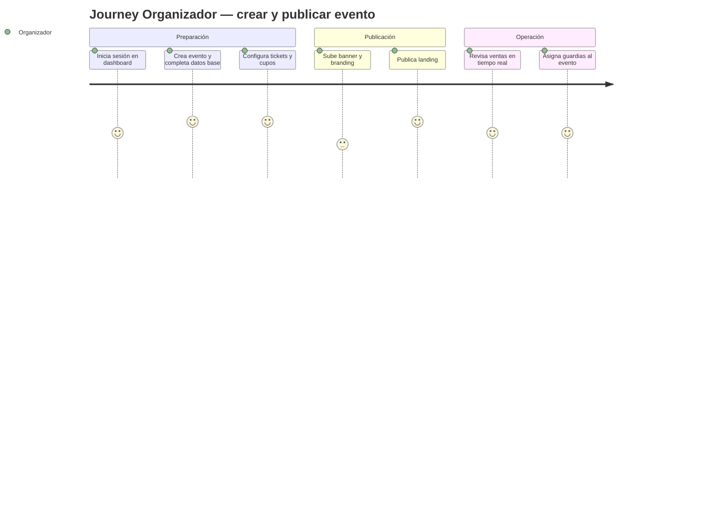
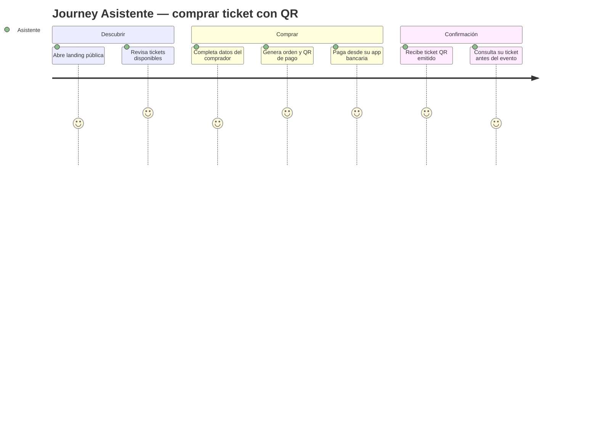
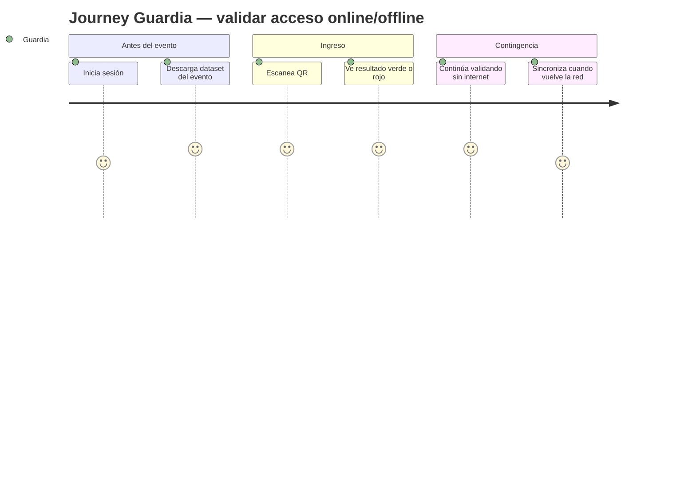

# Product Requirements Document — QrTicket

> Documento de producto de QrTicket basado en [docs/brd/BRD_v0.1.md](../brd/BRD_v0.1.md) y [docs/mrd/MRD_v0.1.md](../mrd/MRD_v0.1.md), siguiendo [templates/PRD_TEMPLATE.md](../../templates/PRD_TEMPLATE.md).

## 0. Metadatos

| Campo | Valor |
|-------|-------|
| Producto | Qrticket |
| Release evaluable | `release/1.0.0` |
| Sesión asociada | `S6` |
| Fecha de cierre | `13/05/2026` |
| Integrantes | `Antonio Ovando, @carlicode, Carla Marcela Florida Roman` |
| Versión | `v0.1` |
| Fecha | `13/05/2026` |
| Product Manager / Autor | Equipo QrTicket |
| Revisores | Docente + Tech Lead + QA |
| Estado | Borrador |
| BRD de referencia | `docs/brd/BRD_v0.1.md` |
| MRD de referencia | `docs/mrd/MRD_v0.1.md` |

## 1. Resumen del producto

QrTicket es una plataforma de gestión de eventos y ticketing digital enfocada en resolver la fricción operativa del contexto boliviano: pagos QR, tickets QR seguros, validación rápida y operación offline para guardias. El producto atiende tres flujos críticos del MVP: gestión de eventos por parte del organizador, compra y recepción del ticket por parte del asistente, y validación en puerta por parte del guardia. El release 1.0.0 prioriza confiabilidad operativa sobre amplitud funcional: venta básica, emisión de tickets, control de acceso, antifraude y reporting esencial.

## 2. Objetivos del producto

| ID | Objetivo del producto | BRD vinculado | Métrica | Meta |
|----|------------------------|---------------|---------|------|
| OP-01 | Permitir que un organizador cree y publique un evento operativo en menos de 15 minutos | BO-06 | tiempo de setup | `<= 15 min` |
| OP-02 | Permitir compra y emisión de ticket en un flujo digital corto | BO-03 | tiempo checkout + emisión | `<= 5 min` total |
| OP-03 | Confirmar pagos y emitir tickets automáticamente | BO-04 | emisión post-confirmación | `<= 30 s` |
| OP-04 | Validar tickets con respuesta clara y segura | BO-01, BO-02 | latencia de validación | `<= 3 s` |
| OP-05 | Mantener operación del guardia aun sin internet | BO-05 | continuidad offline | `100% flujo esencial` |
| OP-06 | Proveer métricas mínimas por evento | BO-06 | panel con ventas/asistencia | disponible en v1.0 |

## 3. Alcance (Scope)

### 3.1 Dentro del alcance (release v1.0)

- Gestión de eventos, tickets y cupos.
- Landing pública del evento.
- Orden de compra y pago QR.
- Emisión de ticket QR único.
- Wallet/historial básico del asistente.
- App de guardias con descarga offline.
- Escaneo QR online y offline con reconciliación.
- Panel de reportes operativos y de asistencia.

### 3.2 Fuera del alcance (backlog)

- Reventa oficial y transferencia entre usuarios.
- Programa de loyalty o membresías.
- Pricing dinámico.
- Marketing automation avanzado.
- Seats.io con mapas interactivos en producción.
- App completa de asistentes con red social/eventos guardados.

### 3.3 Roadmap de versiones

| Versión | Contenido | Fecha objetivo |
|---------|-----------|----------------|
| v1.0 | MVP: eventos, pagos QR, tickets, guardias offline, reportes base | Q3 2026 |
| v1.1 | WhatsApp asistido, reenvío inteligente, mejoras antifraude y métricas | Q4 2026 |
| v2.0 | bot conversacional transaccional, seats numerados, marketing y analytics avanzados | 2027 |

## 4. Personas y user journeys

### 4.1 Personas (resumen)

- **Organizador**: necesita configurar y operar eventos con poco equipo.
- **Asistente**: necesita comprar y entrar con la menor fricción posible.
- **Guardia**: necesita escanear y decidir rápido incluso sin red.

### 4.2 User journeys principales

#### Journey 1 — Organizador publica evento y vende tickets

#### Journey 2 — Asistente compra ticket y lo recibe

#### Journey 3 — Guardia valida acceso en puerta

## 5. User stories y criterios de aceptación

### 5.1 Épica E1 — Gestión de eventos

| ID | Historia | Prioridad | Valor | Esfuerzo | Criterios de aceptación |
|----|----------|-----------|-------|----------|-------------------------|
| PRD-US-001 | Como organizador, quiero crear un evento con datos básicos para iniciar la venta | Must | Alto | M | Dado un organizador autenticado, cuando registra título, fecha, recinto y capacidad, entonces el sistema crea el evento en estado `draft` |
| PRD-US-002 | Como organizador, quiero editar fecha, descripción y branding del evento para mantenerlo actualizado | Must | Alto | S | Dado un evento en `draft` o `active`, cuando cambio campos permitidos, entonces el sistema guarda historial y refleja la actualización en dashboard |
| PRD-US-003 | Como organizador, quiero publicar o despublicar el evento para controlar su visibilidad | Must | Alto | S | Dado un evento válido con al menos un ticket, cuando selecciono publicar, entonces la landing queda visible y el estado cambia a `active` |

### 5.2 Épica E2 — Configuración de tickets

| ID | Historia | Prioridad | Valor | Esfuerzo | Criterios de aceptación |
|----|----------|-----------|-------|----------|-------------------------|
| PRD-US-004 | Como organizador, quiero crear tipos de ticket con precio y cupo para segmentar mi venta | Must | Alto | M | Dado un evento existente, cuando agrego un ticket con nombre, precio y capacidad, entonces el sistema lo habilita para venta |
| PRD-US-005 | Como organizador, quiero configurar ventanas de venta y restricciones por ticket para manejar early bird o VIP | Should | Medio | M | Dado un ticket, cuando defino fechas y restricciones, entonces el sistema sólo lo muestra cuando corresponde |
| PRD-US-006 | Como organizador, quiero visualizar cupos vendidos y disponibles por ticket para decidir cambios operativos | Must | Alto | S | Dado un evento con ventas, cuando abro el módulo de tickets, entonces veo vendidos, reservados y disponibles por tipo |

### 5.3 Épica E3 — Landing y compra

| ID | Historia | Prioridad | Valor | Esfuerzo | Criterios de aceptación |
|----|----------|-----------|-------|----------|-------------------------|
| PRD-US-007 | Como asistente, quiero ver la landing del evento con información clara para decidir mi compra | Must | Alto | M | Dado un evento publicado, cuando abro su landing, entonces veo banner, fecha, ubicación, descripción y tickets disponibles |
| PRD-US-008 | Como asistente, quiero seleccionar un ticket e ingresar mis datos para generar una orden | Must | Alto | M | Dado un ticket disponible, cuando completo formulario válido, entonces el sistema crea una orden pendiente |
| PRD-US-009 | Como asistente, quiero obtener un QR de pago asociado a mi orden para pagar desde mi banco | Must | Alto | M | Dado una orden pendiente, cuando solicito pagar, entonces el sistema genera un QR y referencia únicos |
| PRD-US-010 | Como asistente, quiero ver el estado de mi orden para saber si debo esperar, reintentar o revisar soporte | Must | Alto | S | Dado una orden creada, cuando consulto su detalle, entonces veo estados `pending`, `confirmed`, `expired` o `rejected` |

### 5.4 Épica E4 — Pagos y emisión de tickets

| ID | Historia | Prioridad | Valor | Esfuerzo | Criterios de aceptación |
|----|----------|-----------|-------|----------|-------------------------|
| PRD-US-011 | Como sistema, quiero confirmar automáticamente un pago QR mediante webhook o conciliación para evitar revisión manual | Must | Alto | L | Dado un pago confirmado por proveedor, cuando llega la notificación válida, entonces el sistema marca el pago como `confirmed` |
| PRD-US-012 | Como asistente, quiero recibir mi ticket QR apenas se confirme el pago para no esperar soporte manual | Must | Alto | M | Dado un pago confirmado, cuando la orden pasa a confirmada, entonces el sistema emite el ticket y lo deja disponible al usuario |
| PRD-US-013 | Como asistente, quiero ver el historial de mis tickets para encontrarlos fácilmente antes del evento | Should | Medio | S | Dado un usuario con compras, cuando abre su historial, entonces visualiza tickets activos y estados asociados |

### 5.5 Épica E5 — Recuperación y soporte del ticket

| ID | Historia | Prioridad | Valor | Esfuerzo | Criterios de aceptación |
|----|----------|-----------|-------|----------|-------------------------|
| PRD-US-014 | Como asistente, quiero reenviar o recuperar mi ticket por correo o WhatsApp para no perderlo | Should | Medio | M | Dado un ticket válido, cuando pido reenvío, entonces el sistema dispara una nueva notificación con el ticket correcto |
| PRD-US-015 | Como soporte, quiero buscar una orden o ticket por nombre, correo o teléfono para ayudar rápido al usuario | Should | Medio | M | Dado un rol autorizado, cuando busca por criterio válido, entonces el sistema devuelve coincidencias relevantes |
| PRD-US-016 | Como asistente, quiero recibir un mensaje claro cuando mi orden expira para saber qué hacer | Must | Medio | S | Dado una orden vencida, cuando consulto su estado, entonces veo motivo y acción sugerida |

### 5.6 Épica E6 — Operación de guardias

| ID | Historia | Prioridad | Valor | Esfuerzo | Criterios de aceptación |
|----|----------|-----------|-------|----------|-------------------------|
| PRD-US-017 | Como guardia, quiero iniciar sesión y ver sólo mis eventos asignados para no confundirme | Must | Alto | S | Dado un guardia activo, cuando inicia sesión, entonces ve exclusivamente eventos asignados |
| PRD-US-018 | Como guardia, quiero descargar el dataset del evento para validar tickets sin internet | Must | Alto | L | Dado un evento asignado, cuando solicito sincronizar, entonces la app guarda tickets válidos y metadatos mínimos localmente |
| PRD-US-019 | Como guardia, quiero ver el estado online/offline y la fecha de última sincronización para operar con confianza | Must | Alto | S | Dado la pantalla del evento, cuando la abro, entonces veo conectividad y timestamp de sync |
| PRD-US-020 | Como guardia, quiero cambiar de evento sin perder contexto para cubrir diferentes puertas o franjas | Could | Medio | S | Dado varios eventos asignados, cuando selecciono otro evento, entonces cambia el dataset activo sin mezclar registros |

### 5.7 Épica E7 — Validación y antifraude

| ID | Historia | Prioridad | Valor | Esfuerzo | Criterios de aceptación |
|----|----------|-----------|-------|----------|-------------------------|
| PRD-US-021 | Como guardia, quiero escanear un QR y obtener respuesta inmediata verde o roja para decidir el acceso | Must | Alto | M | Dado un QR válido, cuando lo escaneo, entonces el sistema responde con resultado verificable en `<= 3 s` |
| PRD-US-022 | Como guardia, quiero que el sistema detecte tickets ya usados, cancelados o de evento incorrecto para evitar fraude | Must | Alto | M | Dado un ticket inválido para ese contexto, cuando se escanea, entonces el sistema devuelve motivo explícito |
| PRD-US-023 | Como sistema, quiero reconciliar validaciones offline al recuperar red para mantener una única verdad operativa | Must | Alto | L | Dado escaneos offline pendientes, cuando vuelve la red, entonces la app sincroniza y resuelve conflictos según reglas |

### 5.8 Épica E8 — Reportes y administración

| ID | Historia | Prioridad | Valor | Esfuerzo | Criterios de aceptación |
|----|----------|-----------|-------|----------|-------------------------|
| PRD-US-024 | Como organizador, quiero ver ventas, ingresos y tickets emitidos por evento para monitorear el rendimiento | Must | Alto | M | Dado un evento con transacciones, cuando abro su dashboard, entonces veo KPIs y series básicas |
| PRD-US-025 | Como organizador, quiero ver asistencia real y no-shows para evaluar el evento | Must | Alto | M | Dado un evento operado, cuando consulto reportes, entonces veo tickets emitidos, usados y no usados |
| PRD-US-026 | Como admin, quiero gestionar roles y permisos básicos para mantener seguridad operativa | Must | Alto | M | Dado un usuario administrativo, cuando crea o edita cuentas, entonces puede asignar roles permitidos y estados |

## 6. Priorización

| Método | Ranking |
|--------|---------|
| MoSCoW | Must > Should > Could > Won't |
| RICE | `Reach × Impact × Confidence ÷ Effort` |

### Tabla RICE (top 10)

| ID | Reach | Impact | Confidence | Effort | RICE |
|----|-------|--------|------------|--------|------|
| PRD-US-021 | 1000 | 3 | 0.90 | 5 | 540 |
| PRD-US-011 | 900 | 3 | 0.80 | 8 | 270 |
| PRD-US-018 | 700 | 3 | 0.80 | 8 | 210 |
| PRD-US-012 | 900 | 3 | 0.90 | 5 | 486 |
| PRD-US-001 | 500 | 2 | 0.90 | 3 | 300 |
| PRD-US-004 | 500 | 2 | 0.85 | 3 | 283 |
| PRD-US-008 | 1200 | 3 | 0.85 | 5 | 612 |
| PRD-US-009 | 1200 | 3 | 0.85 | 5 | 612 |
| PRD-US-022 | 1000 | 3 | 0.95 | 5 | 570 |
| PRD-US-024 | 300 | 2 | 0.85 | 3 | 170 |

## 7. Requerimientos funcionales (alto nivel)

| ID | Requisito | Historia(s) | Prioridad |
|----|-----------|-------------|-----------|
| PRD-REQ-001 | El sistema debe permitir CRUD de eventos con estados `draft`, `active`, `sold_out`, `finished`, `cancelled` | PRD-US-001..003 | Must |
| PRD-REQ-002 | El sistema debe permitir configuración de tickets, cupos y restricciones | PRD-US-004..006 | Must |
| PRD-REQ-003 | El sistema debe exponer una landing pública por evento | PRD-US-007 | Must |
| PRD-REQ-004 | El sistema debe crear órdenes de compra y mantener su estado | PRD-US-008, PRD-US-010, PRD-US-016 | Must |
| PRD-REQ-005 | El sistema debe generar un QR de pago y referencia por orden | PRD-US-009 | Must |
| PRD-REQ-006 | El sistema debe emitir tickets QR únicos por pago confirmado | PRD-US-012 | Must |
| PRD-REQ-007 | El sistema debe integrar confirmación de pagos con proveedor QR | PRD-US-011 | Must |
| PRD-REQ-008 | El sistema debe exponer historial y recuperación básica de tickets | PRD-US-013..015 | Should |
| PRD-REQ-009 | La app de guardias debe listar eventos asignados y permitir login operativo | PRD-US-017 | Must |
| PRD-REQ-010 | La app de guardias debe descargar un dataset offline por evento | PRD-US-018, PRD-US-019 | Must |
| PRD-REQ-011 | La app de guardias debe validar QR online y offline | PRD-US-021..023 | Must |
| PRD-REQ-012 | El sistema debe detectar fraude y doble uso del ticket | PRD-US-022, PRD-US-023 | Must |
| PRD-REQ-013 | El dashboard debe mostrar reportes de ventas, ingresos y asistencia | PRD-US-024, PRD-US-025 | Must |
| PRD-REQ-014 | El sistema debe gestionar roles y permisos básicos | PRD-US-026 | Must |
| PRD-REQ-015 | El sistema debe permitir branding básico de la landing | PRD-US-002, PRD-US-007 | Should |
| PRD-REQ-016 | El sistema debe soportar reenvío de ticket por canales configurados | PRD-US-014 | Should |

## 8. Requerimientos no funcionales (alto nivel)

| ID | Categoría | Requerimiento | Métrica | Umbral |
|----|-----------|---------------|---------|--------|
| PRD-NFR-001 | Rendimiento | Respuesta de validación online | p95 | `<= 1500 ms` |
| PRD-NFR-002 | Rendimiento | Generación de orden | p95 | `<= 1000 ms` |
| PRD-NFR-003 | Disponibilidad | Uptime del backend core en días de evento | uptime | `>= 99.5%` |
| PRD-NFR-004 | Seguridad | Integridad del QR y antifraude | incidentes por evento | `< 1%` |
| PRD-NFR-005 | Seguridad | Cifrado de datos sensibles en tránsito | protocolo | HTTPS obligatorio |
| PRD-NFR-006 | Confiabilidad | Éxito de reconciliación offline | porcentaje | `>= 95%` |
| PRD-NFR-007 | Escalabilidad | Capacidad de procesar escaneos simultáneos | throughput sostenido | `>= 50 scans/min/puerta` |
| PRD-NFR-008 | Observabilidad | Trazas de órdenes, pagos y validaciones | cobertura | `100%` eventos críticos |
| PRD-NFR-009 | Usabilidad | Tiempo de aprendizaje de guardia | entrenamiento | `<= 15 min` |
| PRD-NFR-010 | Mantenibilidad | Tiempo promedio de recuperación ante incidente crítico | MTTR | `< 30 min` |

## 9. Dependencias e integraciones

| Sistema | Tipo | Propósito | Riesgo |
|---------|------|-----------|--------|
| Pasarela/banco QR | consumo | cobro y confirmación de pagos | alto |
| WhatsApp / proveedor de mensajería | consumo | notificaciones y soporte | medio |
| Servicio de email | consumo | confirmaciones y recuperación | bajo |
| Almacenamiento de archivos | consumo | banners, tickets y adjuntos | medio |
| App móvil guardias | integración interna | descarga local y sync | alto |
| Analytics/monitoring | consumo | telemetría operativa | medio |

## 10. Supuestos y restricciones

- **Supuestos**: los eventos iniciales no requieren seats numerados; un flujo QR de pago basta para el MVP; los guardias usarán dispositivos Android con cámara.
- **Restricciones**: conectividad variable; equipo pequeño; tiempo acotado; foco en experiencia operativa; dependencia de terceros para pagos/mensajería.

## 11. Experiencia de usuario

- Referencia visual y operativa: [docs/design/ui-ux-ticketing-guidelines.md](../design/ui-ux-ticketing-guidelines.md).
- Principios: feedback inmediato, baja fricción, claridad de estados, contraste alto para guardias, mobile-first en compra y operación.

## 12. Métricas de éxito del producto

- **North Star**: asistentes validados exitosamente por minuto.
- **KPIs de adopción**: eventos activos, organizadores recurrentes, tickets emitidos.
- **KPIs de calidad**: tasa de fraude, latencia de validación, sync offline, MTTR.

## 13. Riesgos del producto

| Riesgo | Prob. | Impacto | Mitigación |
|--------|-------|---------|------------|
| Integración de pagos QR no homogénea | media | alta | encapsular adaptadores y fallback operacional |
| Sync offline genera conflictos complejos | media | alta | reglas claras de reconciliación e idempotencia |
| El guardia no confía en la app | baja-media | alta | interfaz minimal y entrenamiento corto |
| El organizador espera demasiadas funciones en v1.0 | media | media | comunicar alcance y roadmap |
| Picos de ingreso saturan la validación online | media | alta | caché local y predescarga de tickets |

## 14. Trazabilidad

| PRD ID | BRD | MRD | FSD |
|--------|-----|-----|-----|
| PRD-REQ-001 | BR-001 | MRD-N-01 | FSD-UC-001 |
| PRD-REQ-002 | BR-001 | MRD-N-01 | FSD-UC-002 |
| PRD-REQ-003 | BR-002, BR-011 | MRD-N-02, MRD-N-11 | FSD-UC-003 |
| PRD-REQ-004 | BR-002 | MRD-N-02 | FSD-UC-004 |
| PRD-REQ-005 | BR-006 | MRD-N-06 | FSD-UC-004 |
| PRD-REQ-006 | BR-003 | MRD-N-03 | FSD-UC-005 |
| PRD-REQ-007 | BR-006, BR-007 | MRD-N-06, MRD-N-07 | FSD-UC-005 |
| PRD-REQ-008 | BR-012 | MRD-N-12 | FSD-UC-006 |
| PRD-REQ-009 | BR-009 | MRD-N-09 | FSD-UC-007 |
| PRD-REQ-010 | BR-005 | MRD-N-05 | FSD-UC-007 |
| PRD-REQ-011 | BR-004, BR-005, BR-010 | MRD-N-04, MRD-N-05, MRD-N-10 | FSD-UC-008, FSD-UC-009 |
| PRD-REQ-012 | BR-010 | MRD-N-10 | FSD-UC-008, FSD-UC-009 |
| PRD-REQ-013 | BR-008 | MRD-N-08 | FSD-UC-010 |
| PRD-REQ-014 | BR-009 | MRD-N-09 | transversal |
| PRD-REQ-015 | BR-011 | MRD-N-11 | FSD-UC-003 |
| PRD-REQ-016 | BR-012 | MRD-N-12 | FSD-UC-006 |

## 15. Anexos

- KPIs operativos por etapa del evento.
- Estados de órdenes, pagos y tickets.
- Mapeo entre roles y módulos.

## 16. Registro de cambios

| Versión | Fecha | Autor | Cambio |
|---------|-------|-------|--------|
| v0.1 | 13/05/2026 | Equipo QrTicket | Versión inicial del PRD con 26 user stories |
