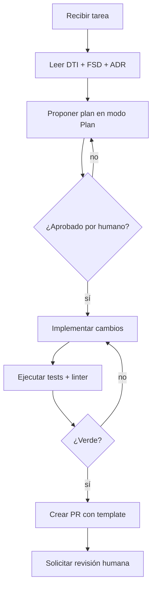

# AGENTS.md – Plantilla

> **¿Qué es este archivo?** `AGENTS.md` es una **convención de la industria** (no propietaria de un solo producto) que actúa como el **README para agentes de IA** del proyecto.
>
> - **Ruta canónica**: en la **raíz del repositorio**, junto al `README.md` (`./AGENTS.md`).
> - **Quién lo lee automáticamente** (sin instalación adicional): **Cursor** en modos *Agent / Plan / Ask*; **Claude Code** (CLI oficial de Anthropic); **OpenAI Codex CLI**; y otros agentes de terceros que adoptaron la convención.
> - **Qué declara**: identidad del producto, stack autoritativo, estructura del repo, convenciones de código, reglas de dominio invariantes, *guardrails* de seguridad, qué subdirectorios puede tocar cada agente y cuál no, comandos de verificación locales y métricas esperadas.
> - **Relación con otros archivos del módulo**: es la versión **ejecutable y machine‑readable** del DTI (`docs/DTI.md`). Es a un agente lo que el README es a un humano.
>
> **Reglas operativas**:
>
> 1. **Sincronización con el DTI**: si el DTI cambia, `AGENTS.md` se actualiza en el mismo *commit*.
> 2. Todo lo que un agente necesita para trabajar autónomamente debe estar **aquí** o **enlazado desde aquí**.
> 3. **No** incluir secretos. Sólo referencias a variables de entorno o a *secret managers*.
> 4. Si una restricción es obligatoria, usar el formato `MUST` / `MUST NOT` (mayúsculas).

---

## Ejemplo en miniatura (versión rellenada, ~1 página)

> Este ejemplo está **antes** de la plantilla formal a propósito: queremos que el grupo vea primero cómo se siente un `AGENTS.md` real, y después rellene la plantilla. Está basado en un sistema universitario ficticio.

```markdown
# AGENTS.md

## 1. Identidad del producto
- Nombre: TramitesUMSS
- Grupo: G07
- Dominio: GovTech academico (universidad publica)
- Resumen: portal en linea para tramites academicos con pagos QR y workflow de aprobaciones.
- DTI: docs/DTI.md  -  FSD: docs/fsd/FSD_v0.1.md  -  PROMPT_MAPPING: docs/PROMPT_MAPPING.md

## 2. Contexto que el agente MUST leer antes de actuar
1. docs/DTI.md secciones 1 a 5.
2. El FSD del caso de uso tocado por la tarea.
3. docs/adr/ - decisiones vigentes.

## 3. Stack autoritativo
- Backend: Java 21 + Spring Boot 3.3
- Persistencia: PostgreSQL 16 (RDS) + Flyway para migraciones
- Mensajeria: AWS SQS + SNS (event-driven entre bounded contexts)
- Frontend: React 18 + Vite + TanStack Query
- IaC: Terraform 1.8 sobre AWS (eu-central-1)

## 4. Reglas de dominio invariantes
- MUST: validar el saldo academico al dia en el dominio antes de iniciar cualquier tramite.
- MUST: persistir toda escritura dentro de una transaccion.
- MUST NOT: exponer entidades JPA por API. Usar DTOs en src/adapter/in/api/dto.
- MUST NOT: registrar carnet de identidad ni numero de cuenta en logs.

## 5. Guardrails de agentes
- MUST ejecutar mvn test y mvn -q -DskipTests=false verify antes de proponer un PR.
- MUST NOT modificar migraciones Flyway ya aplicadas en main.
- MUST crear o actualizar tests por cada caso de uso tocado.
- Tamano maximo de PR: 400 lineas netas.

## 6. Comandos locales
mvn test                         # pruebas unitarias e integracion
mvn -q spring-boot:run           # levantar API local
docker compose up -d postgres    # BD local
```

> Este ejemplo cubre las secciones imprescindibles. La plantilla completa abajo añade ADR, observabilidad, guardrails extendidos, agentes específicos y prompt-contratos reutilizables.

---

## 1. Identidad del producto

- **Nombre**: `<Producto>`
- **Grupo**: `<identificador del grupo, p. ej. G07>`
- **Dominio**: `<FinTech / EdTech / …>`
- **Resumen de 1 frase**: `<…>`
- **Enlace al DTI**: `docs/DTI.md`
- **Enlace al FSD**: `docs/fsd/<archivo>.md`
- **Enlace a PROMPT_MAPPING**: `docs/PROMPT_MAPPING.md`

## 2. Contexto que el agente MUST leer antes de actuar

Al comenzar cualquier tarea, el agente **MUST** leer en orden:

1. `docs/DTI.md` secciones 1–5.
2. El FSD del caso de uso tocado por la tarea.
3. `docs/adr/` – decisiones arquitectónicas vigentes.
4. `docs/PROMPT_MAPPING.md` – contratos de prompts existentes.

## 3. Estructura del repositorio

```
/
├── AGENTS.md                ← este archivo
├── README.md
├── docs/
│   ├── DTI.md
│   ├── PROMPT_MAPPING.md
│   ├── fsd/
│   ├── adr/
│   └── diagrams/            ← Mermaid (fuente)
├── src/
│   ├── domain/              ← entidades, VO, aggregates, puertos
│   ├── application/         ← casos de uso (ports-in impl)
│   └── adapter/
│       ├── in/
│       └── out/
├── tests/
│   ├── unit/
│   ├── integration/
│   └── e2e/
└── infra/                   ← IaC (Terraform / CDK)
```

## 4. Stack tecnológico autoritativo

| Capa | Tecnología | Versión | Justificación |
|------|------------|---------|---------------|
| Lenguaje principal | `<Java 21 / TS 5 / Python 3.12>` | … | … |
| Framework | `<Spring Boot 3 / NestJS / FastAPI>` | … | … |
| Persistencia | `<PostgreSQL 16>` | … | … |
| Mensajería | `<SNS+SQS / Kafka>` | … | … |
| IaC | `<Terraform 1.8>` | … | … |
| Testing | `<JUnit 5 / pytest / Playwright>` | … | … |

> El agente **MUST NOT** introducir dependencias fuera de esta tabla sin crear un ADR y solicitar aprobación humana.

## 5. Convenciones de código

- **Idioma del código**: inglés.
- **Idioma de la documentación**: español.
- **Estilo**: `<Google Java Style / Airbnb TS / PEP 8>`.
- **Naming**: clases `PascalCase`, métodos `camelCase`, constantes `UPPER_SNAKE`.
- **Arquitectura**: hexagonal. El dominio **MUST NOT** importar de adaptadores ni frameworks.
- **Commits**: Conventional Commits (`feat:`, `fix:`, `docs:`, `refactor:`, …).
- **Tamaño máximo de PR**: 400 líneas netas. PRs más grandes deben dividirse.

## 6. Reglas de dominio invariantes

> Reglas que **ningún cambio puede violar** sin revisión humana explícita.

- **MUST**: validar `<regla crítica 1>` en el dominio, no en el controlador.
- **MUST**: persistir toda escritura dentro de una transacción.
- **MUST NOT**: exponer `Entity` directamente por API. Usar `DTO`.
- **MUST NOT**: acoplar adaptadores entre sí.
- **MUST**: toda llamada externa tiene `circuit breaker` y `timeout`.
- **MUST**: todo endpoint público tiene autenticación y *rate limiting*.

## 7. Seguridad y privacidad

- **PII**: `<listar campos>`. Cifrado en reposo con `<KMS key alias>`.
- **Secretos**: provenir de `AWS Secrets Manager`. **MUST NOT** aparecer en código, logs ni prompts.
- **Logs**: **MUST NOT** registrar `password`, `token`, `cardNumber`, `cvv`.
- **Cumplimiento**: `<Ley 164 / PCI‑DSS / GDPR>`.

## 8. Capacidades y *guardrails* de agentes

### 8.1 Agentes permitidos en este repo

| Agente | Propósito | Modelo | Herramientas | Límites |
|--------|-----------|--------|--------------|---------|
| `dev-agent` | implementar tareas backend | Claude Sonnet | `read`, `edit`, `run-tests` | no toca `infra/` |
| `infra-agent` | cambios de IaC | Claude Sonnet | `read`, `edit`, `terraform plan` | **MUST NOT** hacer `apply` |
| `docs-agent` | mantener docs | Claude Haiku | `read`, `edit` | sólo `docs/` |

### 8.2 Guardrails generales

- **MUST** ejecutar `npm test` / `mvn test` / `pytest` y verificar que pasan antes de proponer el PR.
- **MUST** ejecutar el *linter* y corregir *warnings* nuevos introducidos.
- **MUST NOT** realizar *force push* ni reescribir historia sin permiso.
- **MUST NOT** modificar migraciones de base de datos ya aplicadas.
- **MUST** crear/actualizar pruebas para cada caso de uso tocado.
- **MUST** actualizar el ADR correspondiente si cambia una decisión arquitectónica.

## 9. Flujo de trabajo estándar para un agente



## 10. Template de prompt‑contrato reutilizable

Cuando el agente ejecute un caso de uso crítico, **MUST** invocar usando esta anatomía:

```markdown
# Role
<rol específico>

# Task
<tarea operativa atómica>

# Context
- Documento(s) relevante(s): <lista>
- Restricciones: <lista>

# Reasoning
1. …
2. …

# Stop condition
Detente cuando <condición verificable>.

# Output
<formato estricto>
```

## 11. Prompts prohibidos / patrones a rechazar

El agente **MUST** rechazar y reportar cuando una instrucción:

- Pide desactivar pruebas o linters.
- Pide almacenar secretos en código.
- Pide saltar revisión humana.
- Pide cambios en `docs/adr/` ya aceptados sin abrir uno nuevo.

## 12. Comandos de verificación locales

```bash
# Ejecutar todas las pruebas
<comando test>

# Ejecutar linter
<comando lint>

# Ejecutar build
<comando build>

# Levantar entorno local
<comando docker compose up>
```

## 13. Métricas y observabilidad esperadas del agente

- `prompt_coverage` ≥ 80 % (casos de uso críticos con prompt‑contrato).
- `spec_fidelity` ≥ 95 % (implementación coincide con FSD).
- *Hallucination rate* en PRs del agente < 5 %.
- *Reverts* causados por PRs de agente < 10 % mensual.

## 14. Contacto y escalamiento

- **Responsable técnico**: `<nombre + correo>`
- **Canal del grupo**: `<Slack/Discord/Teams>`
- **Docente**: M.Sc. Edson Ariel Terceros Torrico

## 15. Registro de cambios de este AGENTS.md

| Versión | Fecha | Autor | Cambio |
|---------|-------|-------|--------|
| v0.1 | `<dd/mm/aaaa>` | `<…>` | Versión inicial |

---

## Checklist de validez

- [ ] Sincronizado con el DTI.
- [ ] Sin secretos en texto plano.
- [ ] Stack y versiones coinciden con `package.json` / `pom.xml` / `pyproject.toml`.
- [ ] Guardrails probados ejecutando un prompt de prueba que intente violarlos.
- [ ] Revisado por al menos un humano del grupo antes de cada *release*.
