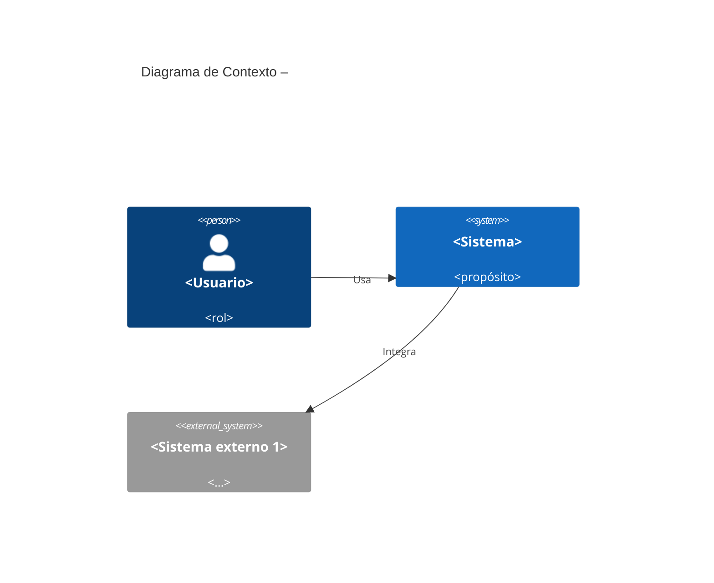
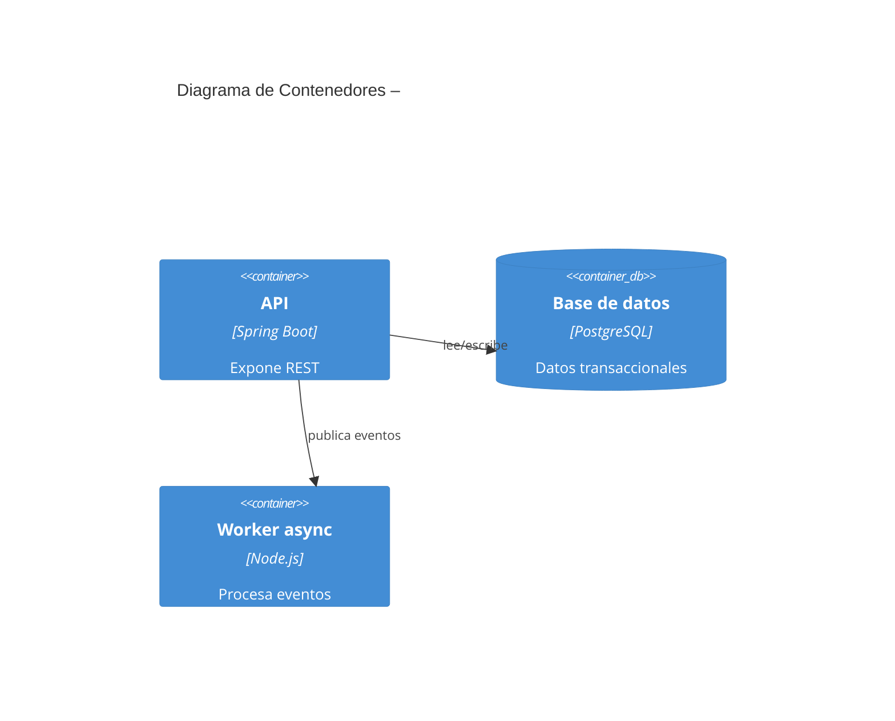
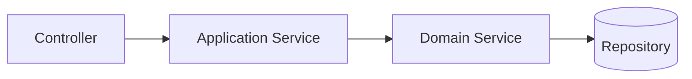
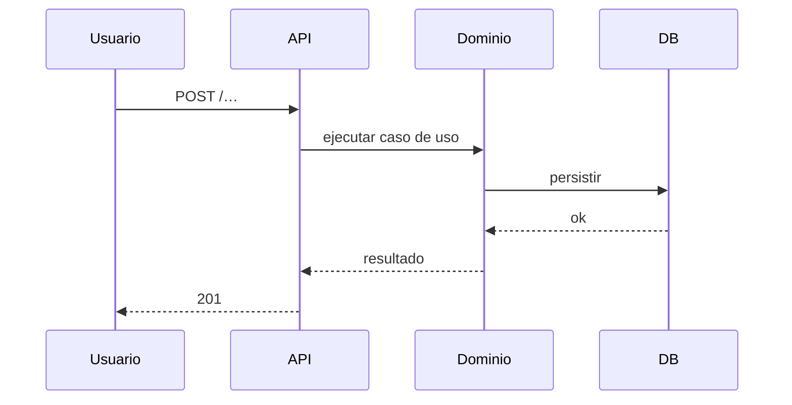
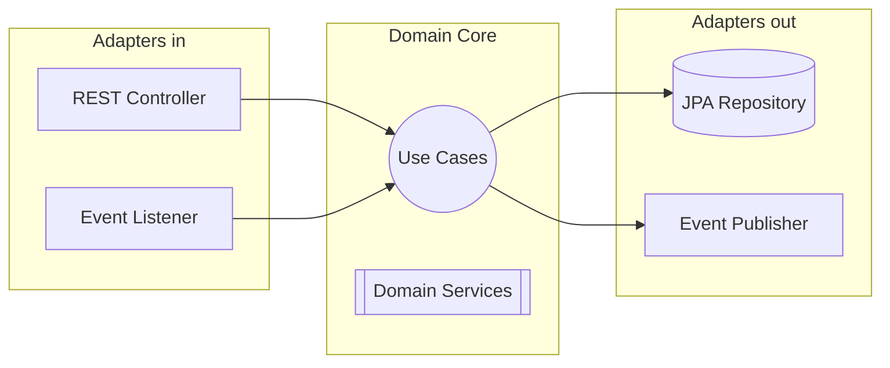
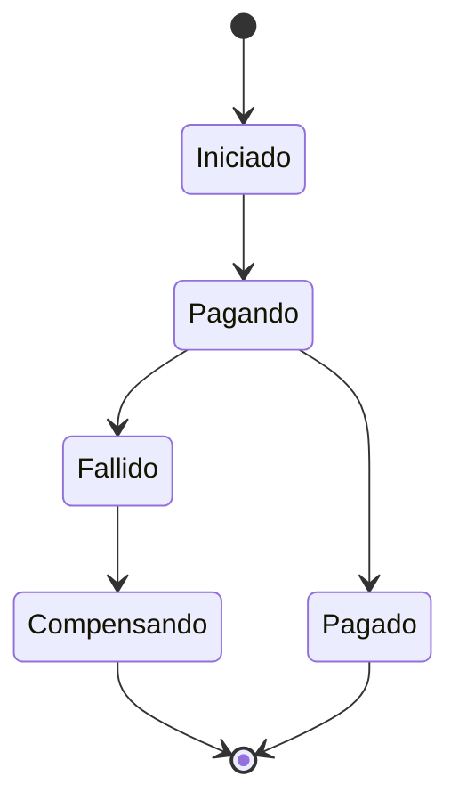
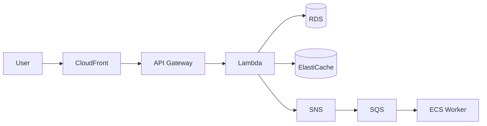
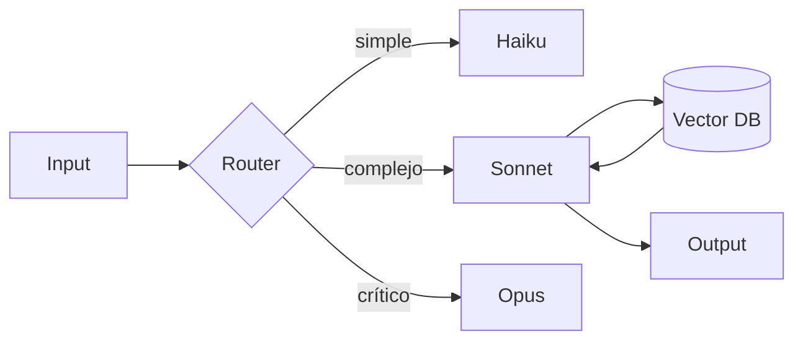

# Documento Técnico Inicial del Producto (DTI) – Plantilla

> **Propósito**: este documento es el **contrato técnico inicial** del producto. Debe ser legible tanto por ingenieros humanos como por agentes de IA. Acompaña obligatoriamente al archivo `AGENTS.md` en la raíz del repositorio.
>
> **Audiencia dual**
> - **Humanos**: arquitectos, desarrolladores, QA, *product managers*.
> - **Agentes IA**: Claude, Cursor Agent, Copilot, agentes custom. Leerán este DTI como contexto primario.
>
> **Regla de oro**: si una decisión arquitectónica significativa no está aquí (o referenciada desde aquí), no existe.
>
> **Plantillas relacionadas**:
> - `plantillas/AGENTS_TEMPLATE.md` – versión ejecutable para agentes.
> - `plantillas/ADR_TEMPLATE.md` – decisiones arquitectónicas individuales.
> - `plantillas/POC_TEMPLATE.md` – pruebas de concepto.
> - `plantillas/PROMPT_TEMPLATE.md` – prompts derivados de specs.
> - `plantillas/FSD_TEMPLATE.md`, `MRD_TEMPLATE.md`, `PRD_TEMPLATE.md`, `BRD_TEMPLATE.md` – cadena documental.

---

## 0. Metadatos

| Campo | Valor |
|-------|-------|
| Producto | `<Nombre>` |
| Grupo | `<G1/G2/G3/G4>` |
| Versión | `v0.1` |
| Fecha | `<dd/mm/aaaa>` |
| Arquitecto responsable | `<…>` |
| Stakeholders | `<…>` |
| Estado | Borrador / En revisión / Aprobado |
| Repositorio | `<url>` |
| Enlace al BRD | `docs/brd/<archivo>.md` (si aplica) |
| Enlace al MRD | `docs/mrd/<archivo>.md` |
| Enlace al PRD | `docs/prd/<archivo>.md` |
| Enlace al FSD | `docs/fsd/<archivo>.md` |
| Enlace a `AGENTS.md` | `/AGENTS.md` |
| Enlace a `PROMPT_MAPPING.md` | `docs/PROMPT_MAPPING.md` |

## 1. Visión del Producto (1 página)

- **Problema**: `<…>`
- **Usuarios objetivo**: `<…>`
- **Propuesta de valor**: `<…>`
- **Métricas de éxito del producto** (1 North Star + 3 secundarias).
- **Restricciones de negocio** clave (presupuesto, plazos, cumplimiento).

## 2. Contexto del Sistema

### 2.1 Diagrama C4 – Nivel 1 (Contexto)

### 2.2 Actores externos y dependencias

| Actor / Sistema | Tipo | Dirección | Criticidad |
|-----------------|------|-----------|------------|
| `<…>` | externo | entrada / salida | alta / media / baja |

## 3. Arquitectura de Alto Nivel

### 3.1 Estilo arquitectónico adoptado

Elegir y **justificar** uno o combinación:

- [ ] Monolito modular
- [ ] Hexagonal / Clean
- [ ] Microservicios
- [ ] Serverless
- [ ] Event‑driven
- [ ] Híbrida (especificar)

> **Justificación** (mínimo 1 párrafo): por qué este estilo dado el dominio, volumen, equipo y restricciones. Crear un ADR independiente con esta decisión (`docs/adr/0001-estilo-arquitectonico.md`).

### 3.2 Diagrama C4 – Nivel 2 (Contenedores)

### 3.3 Diagrama C4 – Nivel 3 (Componentes) del módulo crítico

### 3.4 Data Flow Diagram del caso de uso más crítico

## 4. Modelo de Dominio

### 4.1 Bounded Contexts

| Contexto | Responsabilidad | Entidades principales | Tipo de integración |
|----------|-----------------|-----------------------|---------------------|
| `<…>` | `<…>` | `<Entity1>, <Entity2>` | síncrona / async |

### 4.2 Entidades, Value Objects y Aggregates

| Tipo | Nombre | Invariantes | Ciclo de vida |
|------|--------|-------------|---------------|
| Aggregate Root | `<…>` | `<…>` | … |
| Entity | `<…>` | `<…>` | … |
| Value Object | `<…>` | inmutable | … |

### 4.3 DTOs principales

| DTO | Uso (capa) | Campos | Mapeo a entidad |
|-----|------------|--------|-----------------|
| `<UserDTO>` | API → App | `id, name, email` | `User` |

## 5. Arquitectura Hexagonal del *core*

### 5.1 Puertos (Ports)

| Puerto | Tipo (*input*/*output*) | Definido en | Propósito |
|--------|--------------------------|-------------|-----------|
| `<RegisterUserUseCase>` | input | `domain/port/in` | … |
| `<UserRepository>` | output | `domain/port/out` | … |

### 5.2 Adaptadores (Adapters)

| Adaptador | Implementa | Tecnología | Ubicación |
|-----------|-----------|------------|-----------|
| `<UserRestController>` | `RegisterUserUseCase` | Spring MVC | `adapter/in/web` |
| `<JpaUserRepository>` | `UserRepository` | Spring Data JPA | `adapter/out/persistence` |

### 5.3 Diagrama de puertos y adaptadores

## 6. Arquitectura Distribuida (si aplica)

### 6.1 Microservicios y responsabilidades

| Servicio | Responsabilidad | Datos propios | API expuesta |
|----------|-----------------|---------------|--------------|
| `<order-service>` | gestionar órdenes | `orders` DB | REST /orders |

### 6.2 Patrones de resiliencia aplicados

| Patrón | Dónde | Configuración |
|--------|-------|---------------|
| Circuit breaker | llamadas a `<exchange>` | failureRate 50 %, waitDuration 30 s |
| Rate limiting | `POST /order` | 100 req/s por usuario |
| Sharding | tabla `orders` | por `userId` hash |
| Retry + backoff | integración `<X>` | 3 intentos, exponencial |

## 7. Arquitectura Asíncrona / Event‑Driven

### 7.1 Catálogo de eventos

| Evento | Productor | Consumidor(es) | Payload (schema) | Garantía |
|--------|-----------|----------------|------------------|----------|
| `OrderPlaced` | `order-service` | `portfolio`, `notifications` | JSON Schema link | at‑least‑once |

### 7.2 Flujos de larga duración (*sagas*)

- Describir la saga principal con orquestación vs. coreografía.
- Especificar DLQ, *timeouts*, compensaciones e idempotencia.

## 8. Despliegue – Cloud Native (AWS)

### 8.1 Mapeo de componentes a servicios AWS

| Componente | Servicio AWS | Justificación |
|------------|--------------|---------------|
| API pública | API Gateway + Lambda / ECS Fargate | `<…>` |
| Caché | ElastiCache (Redis) | `<…>` |
| Mensajería | SNS + SQS | `<…>` |
| Orquestación | Step Functions | `<…>` |
| Almacenamiento de objetos | S3 | `<…>` |
| Base de datos | RDS / DynamoDB | `<…>` |
| Balanceo | ELB / ALB | `<…>` |

### 8.2 Diagrama de despliegue (Mermaid)

### 8.3 Entornos

| Entorno | Región | Cuenta AWS | Propósito |
|---------|--------|------------|-----------|
| dev | us-east-1 | `<id>` | desarrollo |
| stg | us-east-1 | `<id>` | QA |
| prd | us-east-1 + us-west-2 | `<id>` | producción multi‑AZ |

### 8.4 Estrategia de Disaster Recovery

- RPO objetivo: `<…>`
- RTO objetivo: `<…>`
- Estrategia elegida: Backup‑Restore / Pilot Light / Warm Standby / Multi‑site (ver ADR correspondiente).

## 9. Capa de IA / Agentes

### 9.1 Arquitectura agéntica

- Tipo: *single‑agent* / *multi‑agent* / *supervisor‑worker* / *router*.
- Modelos usados: `<Claude Sonnet, Haiku, …>`.
- *Tree of models* (si aplica): qué tarea se rutea a qué modelo y por qué.

### 9.2 Agentes del sistema

| Agente | Rol | Herramientas (tools) | *Guardrails* | Observabilidad |
|--------|-----|----------------------|--------------|----------------|
| `<ClasificadorTrámite>` | clasifica solicitudes | `fetchDoc`, `callAPI` | no toma decisiones financieras | logs + trazas |

### 9.3 RAG y memoria

- Vector DB: `<pgvector / Pinecone / OpenSearch>`.
- *Chunking strategy*.
- *Re‑ranker*.
- Política de *freshness* y re‑indexado.

### 9.4 Diagrama de la capa IA

## 10. Estrategia de *Prompt Mapping*

> Este documento vive en `docs/PROMPT_MAPPING.md` y se referencia aquí. Debe contener:

1. Catálogo de artefactos del producto y su origen (humano, Claude, mixto).
2. Prompts por fase con anatomía completa (ver `plantillas/PROMPT_TEMPLATE.md`).
3. Trazabilidad requerimiento → prompt → artefacto.
4. *Guardrails* y criterios de aceptación del *output* IA.
5. Política de versionado y revisión humana.

| Artefacto | Prompts asociados | IDs |
|-----------|-------------------|-----|
| FSD‑UC‑001 | `PR-UC-001`, `PR-UC-001-test` | … |

## 11. NFRs Consolidados (espejo de FSD §10)

| ID | Categoría | Umbral | Mecanismo de verificación |
|----|-----------|--------|---------------------------|
| NFR-001 | Rendimiento | p95 < 100 ms | k6 |
| NFR-002 | Disponibilidad | ≥ 99.9 % uptime mensual | monitoreo CloudWatch |
| NFR-003 | Seguridad | cifrado en reposo AES‑256 | auditoría |
| NFR-004 | Observabilidad | trazabilidad end‑to‑end con `traceId` | OpenTelemetry |
| NFR-005 | Escalabilidad | throughput ≥ `<N>` req/s sostenido | prueba de stress |
| NFR-006 | Cumplimiento | Ley 164 / PCI‑DSS / GDPR | revisión legal |

## 12. POCs Críticas

> Identificar mínimo **2 POCs** que **validen riesgos arquitectónicos** antes de construir todo el producto. Detalle completo en `pocs/<id>/` siguiendo `plantillas/POC_TEMPLATE.md`.

### 12.1 POC‑01: `<Nombre>`

- **Riesgo que mitiga**: `<…>`
- **Hipótesis**: `<…>`
- **Criterio de éxito medible**: `<…>`
- **Alcance (scope reducido)**: `<…>`
- **Cronograma**: `<N días>`
- **Resultado** (llenar post‑ejecución): ✅ / ❌ + lecciones.

### 12.2 POC‑02: `<Nombre>`

*(replicar)*

## 13. Seguridad

- Modelo de amenazas (STRIDE resumido).
- AuthN / AuthZ (OAuth2, RBAC / ABAC).
- Gestión de secretos (AWS Secrets Manager / KMS).
- Protección de datos (PII, cifrado en tránsito y reposo).
- Cumplimiento aplicable (Ley 164 Bolivia, PCI‑DSS, GDPR si aplica).
- Seguridad específica de la capa IA: *prompt injection*, *data exfiltration*, *jailbreak* mitigations.

## 14. Observabilidad

- Logs estructurados (JSON, `correlationId`).
- Métricas (Prometheus / CloudWatch).
- Trazas distribuidas (OpenTelemetry).
- Dashboards y alertas mínimas.
- Observabilidad específica de agentes IA (tokens, latencia de modelo, *hallucination rate*, *guardrail violations*).

## 15. DevOps y ciclo de vida

- Estrategia de *branching*.
- *Pipelines* CI/CD.
- Estrategia de *testing* (pirámide + *contract tests* para prompt‑contratos).
- Estrategia de *releases* y *feature flags*.
- Política de *rollback*.

## 16. Antipatrones auditados

> Declarar explícitamente qué antipatrones se revisaron y cómo se evitaron.

| Antipatrón | ¿Se detectó? | Mitigación |
|------------|--------------|------------|
| Big Ball of Mud | no | módulos por *bounded context* |
| God Service | no | límite de 8 endpoints por servicio |
| Distributed Monolith | riesgo medio | contratos asíncronos + versión semántica |
| Chatty Services | no | uso de BFF |
| Data Swamp | no | *data contracts* y catálogo |

## 17. Trade‑offs arquitectónicos

| Decisión | Opción elegida | Alternativas descartadas | Razones | Consecuencias |
|----------|----------------|--------------------------|---------|---------------|
| Persistencia | PostgreSQL | DynamoDB | transacciones ACID | escalar lectura vía réplicas |

> Cada *trade‑off* significativo debe tener un ADR asociado en `docs/adr/`.

## 18. Riesgos técnicos

| Riesgo | Prob. | Impacto | Mitigación | Plan de contingencia |
|--------|-------|---------|------------|----------------------|
| `<…>` | alta | alto | `<…>` | `<…>` |

## 19. *Roadmap* técnico

- **Ahora (módulo 4)**: DTI + POCs.
- **Siguiente módulo**: implementación *core* (hexagonal).
- **+2 módulos**: integración y despliegue.

## 20. Glosario y referencias

- **Referencias**: PMI PMBOK Software Extension, *Clean Architecture* (R. C. Martin), *C4 Model* (S. Brown), AWS Well‑Architected, Anthropic Claude docs, etc.
- **Glosario**: términos específicos del dominio.

## 21. Registro de decisiones arquitectónicas (ADR)

> Usar `plantillas/ADR_TEMPLATE.md`. Cada decisión significativa crea un archivo `docs/adr/NNNN-titulo-corto.md`.

| ADR | Título | Estado | Fecha |
|-----|--------|--------|-------|
| 0001 | Adopción de arquitectura hexagonal | Aceptada | `<dd/mm/aaaa>` |
| 0002 | `<…>` | Propuesta | `<…>` |
| 0003 | `<…>` | Aceptada | `<…>` |

---

## Checklist de entrega del DTI (30 % de la nota final)

- [ ] Visión del producto + métricas de éxito.
- [ ] Diagramas **C4 niveles 1, 2 y 3** del módulo crítico.
- [ ] *Data flow diagram* del caso de uso más crítico.
- [ ] Modelo de dominio con Aggregates, Entities, VOs, DTOs.
- [ ] Arquitectura **hexagonal** documentada (puertos y adaptadores).
- [ ] Si aplica: catálogo de microservicios y eventos.
- [ ] Mapeo a **AWS** con justificación y costo aproximado.
- [ ] Capa de IA / agentes descrita.
- [ ] **NFRs** con umbrales y mecanismo de verificación.
- [ ] **2 POCs críticas** definidas con criterio de éxito medible (ver `plantillas/POC_TEMPLATE.md`).
- [ ] Seguridad, observabilidad, DevOps cubiertos.
- [ ] **Antipatrones** y *trade‑offs* auditados.
- [ ] Al menos **3 ADRs** registradas (`plantillas/ADR_TEMPLATE.md`).
- [ ] **`AGENTS.md`** sincronizado con este DTI.
- [ ] **`PROMPT_MAPPING.md`** sincronizado.
