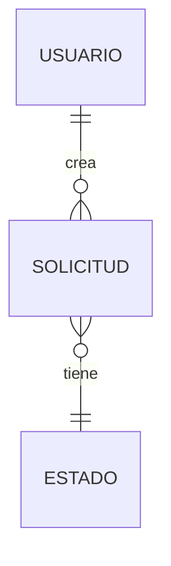

# Functional Specification Document (FSD) – Plantilla

> **Instrucciones para el grupo**: completen todas las secciones. Las partes en `<…>` son marcadores que deben reemplazar. Mantengan trazabilidad explícita a los ítems del PRD usando IDs (`PRD-XX` → `FSD-XX`). Este documento se versiona en Git en `docs/fsd/` y se revisa con Claude como *reviewer*.

---

## 0. Metadatos

| Campo | Valor |
|-------|-------|
| Producto | `<Nombre del producto>` |
| Grupo | `<G1 / G2 / G3 / G4>` |
| Versión del documento | `v0.1` |
| Fecha | `<dd/mm/aaaa>` |
| Autores | `<nombres>` |
| Revisores | Docente + 1 grupo par |
| Estado | Borrador / En revisión / Aprobado |
| Trazabilidad a PRD | `<PRD v….md>` |

## 1. Resumen ejecutivo

Entre 150 y 250 palabras. Responde: **¿qué hace el sistema, para quién, y cuál es el valor diferencial?**.

## 2. Alcance

### 2.1 Dentro del alcance
- `<Funcionalidad 1>`
- `<Funcionalidad 2>`

### 2.2 Fuera del alcance (explícito)
- `<Funcionalidad no incluida 1>`

### 2.3 Supuestos y dependencias
- Supuestos técnicos (stack, plataformas, SLA de terceros).
- Dependencias externas (APIs, pasarelas de pago, proveedores de datos).

## 3. Actores y roles del sistema

| Actor | Tipo (humano/sistema/agente IA) | Responsabilidad principal | Permisos clave |
|-------|---------------------------------|---------------------------|----------------|
| `<Administrador>` | humano | … | … |
| `<Agente clasificador>` | agente IA | … | … |

## 4. Casos de uso funcionales

> Completar **al menos 3 casos de uso críticos** con la estructura siguiente. Cada caso debe estar numerado (`FSD-UC-001`, …) y ligado a un prompt‑contrato en la sección 7.

### 4.1 FSD-UC-001 – `<Nombre del caso de uso>`

- **Trazabilidad**: `PRD-REQ-…`
- **Actor principal**: `<…>`
- **Precondiciones**:
  1. `<…>`
- **Disparador**: `<…>`
- **Flujo principal**:
  1. `<Paso 1>`
  2. `<Paso 2>`
  3. `<…>`
- **Flujos alternativos / excepciones**:
  - `<A1>`: `<descripción>` → resultado esperado.
- **Postcondiciones**:
  1. `<…>`
- **Reglas de negocio aplicables** (referencia a sección 5): `BR-…`
- **Datos de entrada** (ver sección 6):
- **Datos de salida**:
- **Criterios de aceptación** (formato Gherkin sugerido):

```gherkin
Dado   <contexto>
Cuando <acción>
Entonces <resultado verificable>
```

### 4.2 FSD-UC-002 – `<…>`

*(replicar estructura)*

### 4.3 FSD-UC-003 – `<…>`

*(replicar estructura)*

## 5. Reglas de negocio

| ID | Regla | Tipo | Origen | Casos de uso afectados |
|----|-------|------|--------|------------------------|
| BR-001 | `<Descripción formal>` | validación / cálculo / política | PRD-… / normativa externa | FSD-UC-001, … |

## 6. Modelo de datos funcional

### 6.1 Diagrama ER (Mermaid)



### 6.2 Diccionario de datos

| Entidad | Atributo | Tipo | Obligatorio | Validaciones | Origen |
|---------|----------|------|-------------|--------------|--------|
| `<Usuario>` | `id` | UUID | sí | formato UUIDv4 | sistema |
| `<Usuario>` | `email` | string(120) | sí | regex RFC 5322 | usuario |

## 7. Prompt como Contrato Funcional

> Cada caso de uso crítico debe tener un **prompt‑contrato** asociado con los 6 elementos de la anatomía del prompt.

### 7.1 Prompt‑contrato para FSD-UC-001

```markdown
# Role
Eres <rol del sistema/agente>.

# Task
<Qué debe producir este caso de uso en términos operativos>

# Context
- Entrada: <estructura y tipos>
- Referencias de dominio: <reglas BR-… aplicables>
- Restricciones: <reglas de negocio, límites, compliance>

# Reasoning
Pasos obligatorios:
1. <Validar entrada X>
2. <Consultar Y>
3. <Decidir Z>

# Stop condition
Detente cuando: <condición verificable> o cuando se cumpla <caso de error>.

# Output
Formato: <JSON Schema / texto estructurado / evento>
Ejemplo de salida:
```

```json
{
  "status": "ok",
  "data": { "...": "..." }
}
```

**Invariants**: `<lista de invariantes que el output debe cumplir>`
**Failure modes**: `<códigos y mensajes>`

### 7.2 Prompt‑contrato para FSD-UC-002

*(replicar)*

## 8. Integraciones externas

| Sistema | Tipo | Protocolo | Operaciones | SLA esperado | Autenticación |
|---------|------|-----------|-------------|--------------|---------------|
| `<Pasarela de pago>` | síncrono REST | HTTPS | `POST /charge` | 99.9 % / 1.5 s p95 | OAuth2 |

## 9. Interfaces de usuario (referencia)

- Enlace a Figma / mockups del Módulo 2 (UX/UI).
- Mapeo **pantalla → caso de uso**: tabla.

| Pantalla | Caso de uso cubierto |
|----------|----------------------|
| `/login` | FSD-UC-… |

## 10. Requerimientos No Funcionales (NFR)

| ID | Categoría | Requisito | Métrica | Umbral | Cómo se verifica |
|----|-----------|-----------|---------|--------|------------------|
| NFR-001 | Rendimiento | Latencia de `POST /order` | p95 | < 100 ms | prueba de carga k6 |
| NFR-002 | Disponibilidad | `<servicio crítico>` | uptime mensual | ≥ 99.9 % | monitoreo |
| NFR-003 | Seguridad | Cifrado en reposo | AES‑256 | obligatorio | auditoría |
| NFR-004 | Observabilidad | Trazabilidad *end‑to‑end* | % requests con `traceId` | 100 % | OpenTelemetry |
| NFR-005 | Escalabilidad | Throughput máximo | req/s sostenido | ≥ `<N>` | prueba de stress |
| NFR-006 | Cumplimiento | Ley 164 / GDPR / PCI‑DSS | aplicable | según ley | revisión legal |

## 11. Trazabilidad MRD → PRD → FSD

| MRD (necesidad) | PRD (requerimiento) | FSD (caso de uso) | NFR | Prueba de aceptación |
|-----------------|---------------------|-------------------|-----|----------------------|
| `MRD-N-01` | `PRD-REQ-01` | `FSD-UC-001` | `NFR-001` | `TC-01` |

## 12. Plan de pruebas funcionales

- Estrategia (unitarias, integración, E2E, contract testing con prompt‑contratos).
- Herramientas: `<JUnit / pytest / Playwright / k6>`.
- Cobertura mínima aceptada: **`<80 %>`** en dominio *core*.

## 13. Riesgos funcionales

| Riesgo | Probabilidad | Impacto | Mitigación | Responsable |
|--------|--------------|---------|------------|-------------|
| `<…>` | alta / media / baja | alto / medio / bajo | `<…>` | `<…>` |

## 14. Glosario

| Término | Definición |
|---------|------------|
| `<Término>` | `<…>` |

## 15. Registro de cambios

| Versión | Fecha | Autor | Cambio |
|---------|-------|-------|--------|
| v0.1 | `<dd/mm/aaaa>` | `<…>` | Versión inicial |

---

## Checklist de entrega (Avance Intermedio – 40 %)

- [ ] Metadatos completos y versión inicial commiteada en Git.
- [ ] Alcance y fuera de alcance explícitos.
- [ ] **≥ 3 casos de uso críticos** con flujos, excepciones y criterios de aceptación Gherkin.
- [ ] Modelo de datos con diagrama Mermaid y diccionario.
- [ ] **Un prompt‑contrato por caso de uso crítico** con los 6 elementos de la anatomía.
- [ ] Tabla de **NFRs con métrica y umbral medibles**.
- [ ] Matriz de trazabilidad MRD → PRD → FSD → NFR → prueba.
- [ ] Revisión por pares (otro grupo) registrada como comentarios en el PR.
